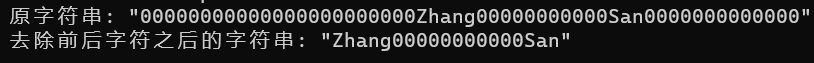
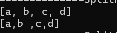
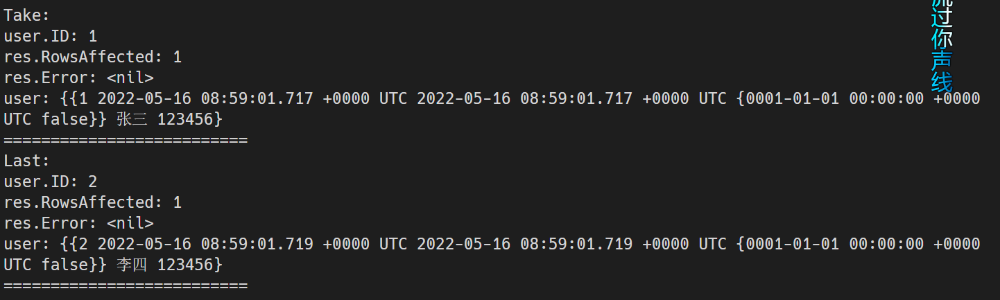
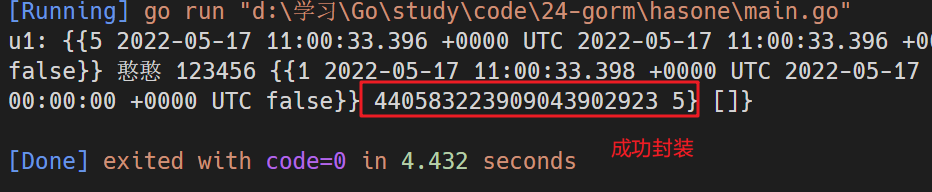
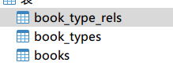

# Golang知识整理

## 进度记录

通过阅读菜鸟教程文档进行学习

https://www.runoob.com/go

**2022/4/30**

变量 -> 变量声明 ✔

...

变量作用域 ✔

TODO 数组 ✔

**2022/5/1**

数组 ✔

...

结构体 ✔

TODO 切片 ✔

...

并发 ✔

基础完结撒花

**2022/5/2**

使用sort.Slice函数实现排序


**2022/5/12**

通过b站视频进一步学习

https://www.bilibili.com/video/BV1zR4y1t7Wj?spm_id_from=333.788.top_right_bar_window_custom_collection.content.click

## 环境安装（Windows）

1. 下载Go语言安装包（msi）

链接：https://go.dev/dl/

2. 将bin目录配置为环境变量


3. 配置Go的模块代理

```sh
go env -w GO111MODULE=on
go env -w GOPROXY=https://goproxy.cn,direct
```


## 语言结构

Go语言的基础组成有以下部分：

- 包声明
- 引入包
- 函数
- 变量
- 语句 & 表达式
- 注释

Go语言中没有面向对象语言中public、protected等修饰符，相对应的修饰限制如下：

- 标识符使用**大写字母开头**，表示使用这种形式的标识符的对象**可以**被外部访问（外界需要引入当前包），相当于public修饰符
- 标识符使用**小写字母开头**，则对包外是不可见的。但是对于整个包的内部是可见且可被访问的，相当于protected修饰符

### Hello World程序

```go
package main

import "fmt"

func main() {
	// 这是我的第一个简单程序，使用的是行内注释
	/*
		这段注释使用的是块注释
	*/
	fmt.Println("Hello World!")
}
```

`package main`：

在每个Go文件中，都应该在**非注释**的第一行进行包声明；在一个Go程序中，必须有一个引入main包的文件，表示程序的入口。

`import "fmt"`:

告诉Go编译器这个程序需要使用到"fmt"包中的函数或其它元素，“fmt”包实现了格式化的IO（输入/输出）函数。

`func main()`:

程序开始执行的函数，一般来说在一个可执行程序中，main函数是在启动后第一个执行的函数（**如果程序中含有`init`函数，则首先执行初始化**）。

`// /**/`:

行内注释和块注释，与Java语言相同。

`fmt.Println()`:

控制台输出函数，与Java中`System.out.println()`方法作用相同。

### 运行Go程序

方式1，直接运行程序：

```sh
go run {文件名，如hello.go}
```


方式2，先编译成二进制文件，再直接运行：

```sh
# 编译
go build hello.go
# 运行
./hello
```


**注意：**Go语言规定，`{`符号不能单独占据一行，否则会报错。

## 基础语法

### 标记

Go程序可以由多个标记组成，可以是关键字、标识符、符号、字符串、常量。

```go
fmt.Println("Hello World!")
```

在以上代码中，共有`6`种标记：

分别是`fmt`、`.`、`Println`、`(`、`"Hello World"`、`)`

### 行分隔符

在Go语言种不像其他很多语言一样需要使用`;`符号进行结尾，**一行代表一个语句结束**。

如果要强行将两个语句写在同一行，则需要使用`;`符号进行人为区分。（不推荐）

```go
fmt.Println("Hello World!")
fmt.Println("haha")
```

以上代码为两个语句。

### 注释

Go语言注释与其它语言基本相同：

- `//`：单行注释
- `/**/`：块注释

### 标识符

标识符用来命名变量、类型等程序实体。

标识符可以由一个或多个字母（A-Z或a-z）数字（0-9）下划线（_)组成的序列，但是第一个字符必须是字母或者是下划线，不能是数字。

### 字符串连接

Go语言的字符串连接可以使用`+`符号连接，与Java相同

### 关键字

Go语言有以下`25`个关键字或保留字：

**加粗**的为Java语言种没有的关键字

|                |                 |                       |           |            |
| -------------- | --------------- | --------------------- | --------- | ---------- |
| break          | default         | **func**              | interface | **select** |
| case           | **defer**       | **go**(开启goroutine) | **map**   | struct     |
| **chan**(通道) | else            | goto                  | package   | switch     |
| const          | **fallthrough** | if                    | **range** | **type**   |
| continue       | for             | import                | return    | **var**    |

Go语言还有`36`个预定义标识符：

|         |           |            |         |       |
| ------- | --------- | ---------- | ------- | ----- |
| append  | bool      | byte       | cap     | close |
| complex | complex64 | complex128 | uint16  | copy  |
| false   | float32   | float64    | imag    | int   |
| int8    | int16     | uint32     | int32   | int64 |
| iota    | len       | make       | new     | nil   |
| panic   | uint64    | print      | println | real  |
| recover | string    | true       | uint    | uint8 |
| uintptr |           |            |         |       |

### 空格

Go语言变量的声明必须使用空格隔开，如：

```go
var age int
```

### 格式化字符串

使用`fmt.Sprintf()`函数可以格式化字符串，如Java语言中的`System.out.printf()`

实例代码：

```go
package main

import (
	"fmt"
)

func main() {
	// %d表示整形数字，%s表示字符串
	var code = 123
	var enddate = "2022/4/30"
	var target = fmt.Sprintf("code=%d&endDate=%s", code, enddate)
	fmt.Println(target)
}
```


## 数据类型

Go语言按照类别有以下几种类型：

**布尔型：**

布尔型的值只可以是常量`true`和`false`

**数字类型：**

整形`int`和浮点型`float32`、`float64`

Go有基于架构的类型，例如：`int`、`uint`和`uintptr`

整数型：

| 序号 | 类型和描述                                                   |
| ---- | ------------------------------------------------------------ |
| 1    | **uint8**（无符号8位整型[0, 255]）                           |
| 2    | **uint16**（无符号16位整型[0, 65535]）                       |
| 3    | **uint32**（无符号32位整型[0, 4294967295]）                  |
| 4    | **uint64**（无符号64位整型[0, 18446744073709551615]）        |
| 5    | **int8**（有符号8位整型[-128, 127]）                         |
| 6    | **int16**（有符号16位整型[-32768, 32767]）                   |
| 7    | **int32**（有符号32位整型[-2147483628, 2147483647]）         |
| 8    | **int64**（有符号64位整型[-9223372036854775808, 9223372036854775807]） |

浮点型：

| 序号 | 类型和描述                          |
| ---- | ----------------------------------- |
| 1    | **float32**（IEEE754 32位浮点型数） |
| 2    | **float64**（IEEE754 64位浮点型数） |
| 3    | **complex64**（32位实数和虚数）     |
| 4    | **complex128**（64位实数和虚数）    |

其他数字类型：

| 序号 | 类型和描述                                  |
| ---- | ------------------------------------------- |
| 1    | **byte**（字符型，等价于uint8)              |
| 2    | **rune**（类似int32)                        |
| 3    | **uint**（32或64位）                        |
| 4    | **int**（与uint一样大小）                   |
| 5    | **uintptr**（无符号整型，用于存放一个指针） |

**字符串类型**

**派生类型：**

- 指针类型（Pointer）
- 数组类型
- 结构化类型（struct）
- **Channel类型**
- 函数类型
- **切片类型**
- 接口类型（interface）
- Map类型

## 变量

声明变量的一般形式是使用`var`关键字：

```go
var identifier type
```

也可以一次声明多个变量：

```go
var identifier1, identifier2 type
```

实例：

```go
package main

import "fmt"

func main() {
	var name string = "Ambitious"
	fmt.Println(name)
	var code1, code2 int = 1, 2
	fmt.Println(code1, code2)
}
```


### 声明变量

1. 指定变量类型，如果没有初始化，变量默认为零值

零值就是变量没有初始化时系统默认设置的值

```go
var name type
name = value
```

实例：

```go
// 变量声明
// 1 手动赋值初始值
var name = "ZhangSan"
// 2 使用默认零值
var a int
var b bool
fmt.Print(name, a, b)
```


以下列出不同变量类型的零值：

- 数值类型（包括complex64/128）为**0**

- 布尔类型为**false**

- 字符串为**""**（空字符串）

- 以下几种类型为**nil**

  ```go
  var a *int
  var a []int
  var a map[string]int // k:string, v:int的map集合
  var a chan int // int类型的通道
  var a func(string) int // 一个string参数，返回值是int的函数
  var a error // error 是接口
  ```

2. 根据值自动判断变量的类型

```go
var name = value
```

实例：

```go
func definition1() {
	// 根据值自动判断变量类型
	var a = true
	fmt.Println(a)
}
```


3. 使用`:=`声明（前提是变量没有使用`var`声明过）

实例：

```go
func definition2() {
	// 使用:=进行变量声明
	intVal := 1
	stringVal := "Ambitious"
	fmt.Println(intVal, stringVal)
}
```


`intVal := 1`相当于`var intVal = 1`

### 多变量声明

```go
func definition3() {
	// 多变量声明
	var a, b, c int
	a, b, c = 1, 2, 3
	fmt.Println(a, b, c)

	var d, e, f = 4, 5, 6
	fmt.Println(d, e, f)
	
    // 这种不带声明格式的只能在函数体中使用
	g, h, i := 7, 8, 9
	fmt.Println(g, h, i)

	// 使用因式分解的写法一般用于声明全局变量
	var (
		j int
		k string
	)
	j = 10
	k = "hahaha"
	fmt.Println(j, k)
}
```


### 值类型和引用类型

所有像int、float、bool、string这些基本类型都属于值类型，使用这些类型的变量直接指向存在内存中的值。

可以通过`&i`来获取变量i的内存地址


复杂的数据通常会需要使用多个字，这些数据一般使用引用类型保存。

一个引用类型变量存储的是变量值所在的内存地址，或内存地址中第一个字所在的位置，这个内存地址称为指针。

引用类型的指针指向的多个字可以在连续的内存空间中，也可以将这些字分散在内存中，每个字都指示了下一个字所在的内存地址。

### 使用:=赋值操作符

在声明变量的时候可以由系统自动推断类型，但是每次都写var关键字就显得有些多余，大多时候都是使用:=操作符类代替var关键字，称之为**初始化声明**。

**注意事项：**

1. 这种操作符只能用于函数体内，不能用于全局变量的声明与赋值。
2. 在相同的代码块中，不可以再次对于相同名称的变量使用初始化声明。


如果声明了一个局部变量却没有在相同的代码块中去使用它，则编译会报错。而全局变量则允许只声明不使用。


多变量可以在同一行中进行赋值，如：

```go
a, b, c := 1, 2, "abc"
```

这种赋值被称为并行赋值。

如果想要交换两个变量的值，可以简单的使用`a, b = b, a`来进行交换，前提是两个变量的类型是相同的。

Go语言的特点之一是函数可以返回多个值，但有时候调用函数时不需要使用函数所有的返回值，可以使用空白标识符（`_`)来进行占位，如：

```go
_, a = Func(val)
```

`_`是一个只写变量，通常用于抛弃不想要的值。

## 常量

常量中的数据类型只可以是布尔型、数字型和字符串型

常量的定义格式：

```go
const identifier [type] = value
```

> 可以省略类型说明符type，由编译器自动推断类型

常量使用示例：

```go
package main

import (
	"fmt"
	"unsafe"
)

func main() {
	// 1 常量完整的定义形式
	const WIDTH int = 10
	const HEIGHT int = 20
	area := WIDTH * HEIGHT
	fmt.Println(area)
	// 2 使用并行赋值常量
	const a, b, c = 1, false, "abc"
	fmt.Println(a, b, c)
	// 3 常量用作枚举
	const (
		// 未知
		Unknow = 0
		// 男性
		Female = 1
		// 女性
		Male = 2
	)
	fmt.Println(Unknow, Female, Male)
	// 4 在常量中使用内置函数计算表达式的值
	const (
		d = "abc"
		e = len(d)
		f = unsafe.Sizeof(a)
	)
	fmt.Println(d, e, f)
}
```


### iota

iota是一个特殊常量，可认为是一个可以被编译器修改的常量，也可理解为const语句块中的行索引

示例：

```go
func iota_test() {
	// iota常量用作枚举
	const (
		a = iota
		b = iota
		c = iota
	)
	fmt.Println(a, b, c)
	// 常量枚举的简写
	const (
		d = iota
		e
		f
	)
	fmt.Println(d, e, f)
}
```


- iota会从0开始，随着常量代码块行数的增加而增加，不会受外界影响。
- 在常量枚举中，如果定义的常量没有赋值（第一个常量必须赋值），则会使用它上方最近一个被赋值过的常量作为自己的值。在以上例子中，e、f只声明，没有赋值，所以会使用d的值iota作为自己的值。

## 运算符

运算符用于在程序运行时执行数学或逻辑运算

Go语言内置的运算符有：

- 算术运算符
- 关系运算符
- 逻辑运算符
- 位运算符
- 赋值运算符
- 其他运算符

### 算术运算符

+、-、*、/、%、++、--（与Java相同）

### 关系运算符

==、!=、>、<、>=、<=（与Java相同）

### 逻辑运算符

&&、||、!（与Java相同）

### 位运算符

&、|、^、<<、>>（与Java相同）

### 赋值运算符

=、+=、-=、*=、/=、%=、<<=、>>=、&=、^=、|=（与Java相同）

### 其他运算符

&：返回变量存储地址（&a会给出变量a的实际存储地址）

*：指针变量（ *a是一个指针变量）

## 条件语句（与Java相同）

## 循环语句


### for循环

for循环有三种形式，分别如下

1. 与C语言的for一样

```go
for init; condition; post {
    code...
}
```

2. 与C语言的while一样

```go
for condition {
    code...
}
```

3. 与C语言的for(;;)一样（无限循环）

```go
for {
    code...
}
```

4. range格式

可以对slice、map、数组、字符串等进行迭代遍历：

```go
for key, value := range oldMap {
    newMap[key] = value
}
```

```go
package main

import "fmt"

func main() {
	numbers := [6]int{1, 2, 3, 4, 5}
	for index, number := range numbers {
		fmt.Printf("第 %d 位的数为 %d\n", index, number)
	}
}
```


> 小记：
>
> 在Java语言中，如果要动态初始化一个数组可以用以下方式：
>
> ```java
> int n = 100;
> int[] arr = new int[n];
> ```
>
> 在Go语言中，可以使用make函数来实现相同的功能，这种方式创建出来的数据类型是切片（slice），下文会详细说明
>
> ```go
> n := 100
> arr := make([]int, n)
> ```

### 循环嵌套

与Java语言没有太大差别

### 循环控制语句

break: 中断当前for循环或switch语句

continue：跳过当前循环剩余的语句，并进行下一轮循环

goto：将控制转移到标记语句（goto语句会降低程序的可读性，一般不建议使用）

## defer语句

被defer关键字修饰的语句会被延迟到函数体结束前执行，具体效果相当于将每一个被defer声明的语句都存入栈中，函数返回之前再将这些语句拿出来调用。**也就是说，先被defer修饰的语句是后执行的！**

示例：

```go
func main() {
	fmt.Println("start....")
	defer fmt.Println("s1")
	defer fmt.Println("s2")
	defer fmt.Println("s3")
	fmt.Println("end....")
}
```


## 函数

Go语言中函数定义格式如下：

```go
func function_name([parameter_list]) [return_type] {
    code...
}
```

- func：函数由func关键字声明
- function_name：函数名称
- parameter_list：参数列表，函数可以不指定参数
- return_types：返回类型，函数返回一列值，return_types是该列值的数据类型，return_types也不是必须的。

示例：

求两个整型数中的较大值

```go
// 求两数的最大值，接收两个整型数，返回两个数中较大数
func max(a, b int) int {
	// 定义局部变量
	var res int
	if a < b {
		res = b
	} else {
		res = a
	}
	return res
}
```

### 函数返回多个值

将返回值列表拼接在参数列表后边，并用`()`括起来即可

```go
func swap(a, b string) (string, string) {
	return b, a
}
```


### 函数参数

使用值传递：在调用函数时将实际参数复制一份传递到函数中。

使用引用传递：在调用函数时将实际参数的地址传递到函数中。

默认情况下，Go语言使用的是值传递。


使用引用传递交换两个数的例子：

```go
func main() {
	c, d := 200, 300
	fmt.Printf("交换前c=%d, d=%d\n", c, d)
    // 传入两个变量的地址
	swapInt(&c, &d)
	fmt.Printf("交换后c=%d, d=%d\n", c, d)
}

// 将传递过来的两个引用进行交换
func swapInt(a, b *int) {
	tmp := *a
	*a = *b
	*b = tmp
}
```


### 闭包

闭包实际上就是“函数内部定义函数”，与普通函数的区别是：

- 内部函数可以直接使用外部函数的变量
- 只要内部函数的生命周期存在，外部函数的变量就不会丢失

示例：

1. 给字符串添加后缀名：

```go
// 示例1：后缀函数生成器
// 给定一个文件后缀suffix，返回一个后缀生成函数
// 只需要传入一个字符串，就可以在字符串后面在拼接上给定的后缀
func MakeSuffixFunc(suffix string) func(string) string {
	return func(base string) string {
		if !strings.HasSuffix(base, suffix) {
			base += suffix
		}
		return base
	}
}

func main() {
	// 示例1
	jpgSuffix := MakeSuffixFunc(".jpg")
	fmt.Println(jpgSuffix("test"))
	txtSuffix := MakeSuffixFunc(".txt")
	fmt.Println(txtSuffix("abc"))
}
```


2. 计数器：

```go
// 示例2：计数器
// 传入一个base值，每次参数计数器的运算
// 返回两个函数:
// add: 返回base + 形参
// sub: 返回base - 形参
func Cal(base int) (add func(int) int, sub func(int) int) {
	add = func(a int) int {
		return base + a
	}
	sub = func(a int) int {
		return base - a
	}
	return
}

func main() {
	// 示例2
	af, sf := Cal(100)
	fmt.Println(af(30), sf(50))
	fmt.Println(af(40), sf(60))
	af, sf = Cal(100)
	fmt.Println(af(3), sf(4))
	fmt.Println(af(5), sf(6))
}
```


## 变量作用域（与Java相同）

- 全局变量
- 局部变量
- 形式参数（函数中定义的变量，也是局部变量）

## 数组

### 声明数组

声明数组的时候需要指定数组的类型和元素的个数：

```go
var array_name [SIZE]type
```

声明一个长度为10，类型为float32的数组balance代码如下：

```go
var balance [10]float32
```

### 初始化数组

1. 常规初始化方法

```go
var arr1 = [5]int{1, 2, 3, 4, 5}
```

2. 使用字面量快速初始化

```go
arr2 := [6]int{1, 2, 3, 4, 5, 6}
```

3. 让编译器自动推断数组的长度

> 如果不加`...`，创建出来的是切片

```go
arr3 := [...]int{1, 2, 3, 4, 5, 6, 7}
```

4. 通过指定下标初始化元素（前提是数组已经指定了长度）

```go
arr4 := [5]int{1: 3, 3: 8}
```

`{}`中元素的个数不能超过`[]`中指定的数组大小

如果`[]`中不指定数组的大小，编译器会自动根据`{}`中元素的个数设置数组的大小

### 访问数组元素（与Java相同）

### 多维数组

常用的多维数组声明方式：

```go
var array_name [SIZE1][SIZE2]...[SIZEN]type
```

声明一个三维的整型数组：

```go
var arr [5][10][4]int
```

### 初始化二维数组

1. 在声明的时候给整个数组直接赋值

```go
arr5 := [3][4]int{
    {1, 2, 3, 4},
    {5, 6, 7, 8},
    // 最后一行的末尾必须加上逗号，否则编译器会报错
    {9, 10, 11, 12},
}
```

2. 声明数组之后，使用`append`函数进行赋值

```go
// 这里不能指定数组的大小，否则编译器会报错
arr6 := [][]int{}
arr6 = append(arr6, []int{1, 2, 3})
arr6 = append(arr6, []int{4, 5, 6})
```

> 疑问解答：为什么使用append函数时不能指定“数组”的大小？
>
> 当初始化一个数组指定了具体的大小时，它是一个普通数组。如果不指定大小，那么它是一个切片（slice）。
>
> append函数的参数接收的值**必须**是切片，所以传入一个数组的时候会报错。

访问二维数组的时候与Java相同，不再赘述

### 向函数传递数组

1. 形参设定数组大小

```go
func myFunction(param [10]int) {
    // code...
}
```

2. 形参不设定数组大小

```go
func myFunction(param []int) {
    // code...
}
```

示例：

定义函数`getAverage`，接收一个数组，并计算数组的平均值

```go
func main() {
	// 定义函数`getAverage`，接收一个数组，并计算数组的平均值
	arr7 := []int{1, 2, 5, 8, 1}
	ans := getAverage(arr7)
	fmt.Printf("数组的平均值为：%.3f", ans)
}

// 计算一个数组的平均值
func getAverage(arr []int) (ans float32) {
	if arr == nil {
		return
	}
	// 获取数组的大小
	n := len(arr)
	for i := 0; i < n; i++ {
		ans += float32(i)
	}
	ans /= float32(n)
	return
}
```


## 指针

指针指向了一个值的内存地址

指针声明语法如下：

```go
var ptr_name *type
```

声明一个指向整型的指针和一个指向浮点型的指针

```go
var ip *int
var fp *float32
```

示例：

定义一个整型变量和一个整型指针，用指针指向该变量的内存地址

```go
var a int
var ap *int
a = 1
ap = &a
fmt.Printf("变量a的地址为: %x\n", &a)
fmt.Printf("指针ap的值为: %x\n", ap)
fmt.Printf("指针ap指向的地址的内容为: %d\n", *ap)
```


### 空指针

Go语言中使用`nil`表示空指针，代表零值或空值

### 指针数组

与数组基本一致，只不过指针数组专门存储指针

声明指针数组的语法：

```go
var ptr [SIZE]*int
```

### 指向指针的指针

指针变量存放的是另一个指针变量的地址

声明指向指针的指针格式如下：

```go
var pptr **int
```

要访问指向指针的指针变量值需要使用两个`*`号：

```go
fmt.Printf("变量值为: %d\n", **pptr)
```

### 指针作为函数参数

使用方式非常简单，只需要在函数定义的参数设置为指针类型即可。

在[函数参数](#函数参数)章节中已经给出使用指针作为函数参数，交换两个整型变量值的例子，这里不在举例。

## 结构体

与C语言一样，Go语言可以自定义结构体类型，在结构体中可以为不同项定义不同的数据类型，这里可以将结构体理解为Javascript中的对象。

### 定义结构体

结构体定义需要使用`type`和`struct`语句。如下：

```go
// 图书结构
type Book struct {
	id int
	title string
}
```

### 声明结构体

```go
// 声明结构体1
book1 := Book{1, "计算机网络"}
// 声明结构体2
book2 := Book{title: "程序员代码面试指南", id: 2}
fmt.Println(book1, book2)
```


### 访问结构体成员

访问方式如下：

与其他很多语言都类似，不再赘述

```go
结构体.成员名
```

结构体可以跟其它数据类型一样：

- 作为函数参数
- 使用一个结构体类型指针指向一个结构体变量

## 切片（slice）

切片是对数组的抽象

数组和切片的区别是数组的长度不可改变，而**切片的长度是可以改变的**，即动态数组。

### 定义切片

定义切片与定义数组相似，区别就是切片不需要指定数组的长度。

1. 常规的定义方式

```go
var identifier []type
```

2. 使用`make()`函数来定义切片

>  这种方式在之前小记([循环语句](#循环语句))中提到过，并与java动态初始化数组进行比较。

make函数的定义：

```go
func make(T type, size ...int)
```

创建一个int类型的，长度为len的切片

```go
slice := make([]int, len)
```

创建一个int类型的，初始长度为0，容量为len的切片

容量（capacity）指定了当前切片的**最大长度**（解释见下文）

```go
slice := make([]int, 0, len)
```

### 切片初始化

1. 与数组相同的初始化方式

```go
slice1 := []int{1, 2, 3}
```

2. 初始化切片为一个数组的引用

```go
arr := [5]int{1, 2, 3, 4, 5}
slice2 := arr[:]
```

3. 以数组中某个范围内的元素作为初始值初始化切片

取出数组arr中区间`[1, 3)`范围内的元素来初始化切片

```go
slice3 := arr[1:3]
```

取出数组arr中区间`[0, 3)`范围内的元素来初始化切片

```go
slice4 := arr[:3]
```

取出数组arr中区间`[1, len(arr))`范围内的元素来初始化切片

```go
slice5 := arr[1:]
```

### len()和cap()函数

切片是可索引的，且可以使用`len()`函数获取长度

`cap()`函数用来测量切片的容量最大可以到多少

编写一个打印切片参数的函数：

```go
// 打印切片长度、容量、内容
func printSlice(x []int) {
	fmt.Printf("len=%d cap=%d slice=%v\n", len(x), cap(x), x)
}
```

用此函数打印上面案例中的几个切片，得出结果如下：


注意到最后一个切片的最大容量为4，

原因是这个切片是以arr作为底层数组而创建的，总长度不能超过原数组长度（原数组长度为5），而切片又从原数组的第1项（0是起始）进行索引，故该切片的最大容量就为4。

### 空切片

一个切片在未初始化之前默认为nil，长度为0

### append()和copy()函数

如果想要增加切片的容量，就需要创建一个新的更大的切片，并将原有的切片拷贝过去。

> 小记
>
> 切片在容量不足的时候会有一个自动扩容的机制：
>
> 1. 原切片容量的两倍如果小于等于当前所需的容量，则切片扩容到当前所需的容量
> 2. 原切片容量的两倍大于当前所需的容量，进一步判断：
>    1. 原切片容量超过`1024`：每次增大的容量为原切片容量的`1/4`，当切片容量大于等于当前所需容量时，停止扩容
>    2. 原切片容量不超过`1024`：切片扩容为原切片容量的两倍

示例：

```go
// 增大切片容量
var numbers1 []int
// 向切片中追加1个元素
numbers1 = append(numbers1, 1)
// 向切片中追加多个元素
numbers1 = append(numbers1, 2, 3, 4)
printSlice(numbers1)
// 创建一个容量为原来的两倍的切片
numbers2 := make([]int, len(numbers1), 2*len(numbers1))
// 将原切片的数据拷贝到新切片上
copy(numbers2, numbers1)
printSlice(numbers2)
```


从运行结果可以看到，新切片保留了原切片的值，并扩大了一倍的容量

## 范围（range）

range关键字用于for循环中迭代数组（array）、切片（slice）、通道（channel）和集合（map）的元素。对于数组和切片，它返回索引和索引对应的值，对于集合，它返回key-value。

示例：

```go
func main() {
	// 定义一个数组
	arr := [5]int{1, 2, 3, 4, 5}
	// 场景1：求和，只需要用到数本身，所以第一个参数可抛弃
	sum := 0
	for _, v := range arr {
		sum += v
	}
	fmt.Println(sum)
	// 场景2：查找，找到数组中某个值位于哪一索引下
	for index, item := range arr {
		if item == 3 {
			fmt.Printf("数字3对应的索引为: %d\n", index)
		}
	}
	// 场景3：遍历集合
	kvs := map[string]string{"chen": "junjun", "zhang": "san"}
	for k, v := range kvs {
		fmt.Printf("%s -> %s\n", k, v)
	}
	// 场景4：按照Unicode遍历字符串
	for i, v := range "go" {
		fmt.Printf("i: %d, v: %c\n", i, v)
	}
}
```


## Map集合

Map是一种无序的键值对集合，可以通过key来快速检索数据

### 定义map

1. 使用map关键字

```go
// 声明并初始化map
var name = map[key_type]value_type {}
```

2. 使用make函数

```go
name := make(map[key_type]value_type)
```

map的简单使用：

```go
func main() {
	// 1 创建一个国家名称map
	countryMap := make(map[string]string)
	countryMap["France"] = "巴黎"
	countryMap["Italy"] = "意大利"
	countryMap["Japan"] = "东京"
	// 2 输出国家首都名
	for key := range countryMap {
		fmt.Printf("%s的首都是: %s\n", key, countryMap[key])
	}
	// 3 判断一个国家是否存在于map中
	capital, ok := countryMap["American"]
	fmt.Println(capital)
	fmt.Println(exist)
	if ok {
		fmt.Printf("American的首都是: %s\n", capital)
	} else {
		fmt.Println("American不在map集合中")
	}
}
```


### delete()函数

可以使用delete函数来删除集合中的元素，使用格式如下：

```go
delete(map_name, key_name)
```

## 递归（recursion）

Go语言进行递归与其他语言相似，这里给出递归求解阶乘的例子：

```go
func main() {
	ans := factorial(15)
	fmt.Printf("15的阶乘为: %d\n", ans)
}

// 递归求解一个数的阶乘
func factorial(n uint64) uint64 {
	if n == 1 {
		return 1
	}
	return n * factorial(n-1)
}
```


## 类型转换

Go中必须显式进行类型转换，格式如下：

```go
type_name(value)
```

将int类型的数转换为float32类型

```go
var a int
var b float32
a = 100
b = float32(a)
```

## 接口

Go语言可以像Java一样定义接口，可以针对不同的结构体给出不同的实现

### 定义方式

```go
type interface_name interface {
    method_name1 [return_type]
    method_name2 [return_type]
}
```

示例：

在这个例子中，结构体就相当于面向对象语言中的实现类，结构体实现接口的标志就是实现接口中定义的**所有方法**，不需要显示指定实现接口。

```go
// 定义一个手机接口
type Phone interface {
	// 打电话给某某人
	call(name string)
}

// 诺基亚结构体
type NokiaPhone struct{}

// 接口实现
func (phone NokiaPhone) call(name string) {
	fmt.Printf("使用诺基亚手机打电话给%s\n", name)
}

// 苹果手机结构体
type IPhone struct{}

// 接口实现
func (phone IPhone) call(name string) {
	fmt.Printf("使用苹果手机打电话给%s\n", name)
}

func main() {
	var phone Phone
	// 使用诺基亚实现
	phone = new(NokiaPhone)
	phone.call("张三")
	// 使用苹果手机实现
	phone = new(IPhone)
	phone.call("李四")
}
```

## 错误处理

Go语言内置了一个错误接口error，提供了简单的错误处理机制。

error接口的定义如下：

```go
type error interface {
    Error() string
}
```

使用方式：

在编码的时候通过实现error接口类型来生成错误信息，

函数通常在最后的返回值中返回错误信息

1. 使用`errors.New`直接返回错误信息

```go
// 对一个数取根号
// 返回两个参数，一个是取根号后的结果，另一个是error接口类型
func Sqrt(n int) (float64, error) {
	if n < 0 {
		// 负数无法求根号
		return 0, errors.New("负数不能取根号")
	}
	return math.Sqrt(float64(n)), nil
}

func main() {
    // 测试1：传入正常的值求根号
	ans1, err1 := Sqrt(25)
	if err1 == nil {
		fmt.Printf("25取根号的结果为: %.3f\n", ans1)
	} else {
		fmt.Println(err1)
	}
	// 测试2：传入异常值
	ans2, err2 := Sqrt(-3)
	if err2 == nil {
		fmt.Printf("-3取根号的结果为: %.3f\n", ans2)
	} else {
		fmt.Println(err2)
	}
}
```


2. 自定义结构体，实现error接口

```go
// 除法异常结构体
type DevideError struct {
	devidee int
	devider int
}

// 除法异常实现error接口
func (de DevideError) Error() string {
	msg := `
		除法运算执行错误, 除数不能为0
		devidee: %d
		devider: 0
	`
	return fmt.Sprintf(msg, de.devidee)
}

// 除法函数
// 这里的第二个返回值可以使用error接口进行替代
func Devide(devidee, devider int) (float64, *DevideError) {
	if devider == 0 {
		return 0, &DevideError{devidee, devider}
	}
	return float64(devidee / devider), nil
}

func main() {
    // 测试3：正常除法
	ans3, err3 := Devide(9, 3)
	if err3 == nil {
		fmt.Printf("9 / 3 的结果为: %.3f\n", ans3)
	} else {
		fmt.Println(err3)
	}
	// 测试4：异常除法
	ans4, err4 := Devide(9, 0)
	if err4 == nil {
		fmt.Printf("9 / 0 的结果为: %.3f\n", ans4)
	} else {
		fmt.Println(err4)
	}
}
```


## 并发

Go语言只需要使用`go`关键字就可以开启一个轻量级运行时线程（goroutine）。

同一个程序的线程共享同一个线程空间

语法格式：

```go
// 使用非匿名函数开启线程
go 函数名(参数列表)
// 使用匿名函数开启线程
go func(参数类型...) {
    // code...
}(参数列表)
```

goroutine示例：

```go
// 每隔1s打印字符串一次
func say(str string) {
	for i := 0; i < 5; i++ {
		time.Sleep(time.Second)
		fmt.Println(str)
	}
}

func main() {
	go say("hello")
	say("world")
}
```


### 通道（channel）

通道是用来传递数据的数据结构，可用于两个goroutine之间通过传递一个指定类型的值来同步运行和通讯。

操作符`<-`用于指定通道的方向，如果未指明方向，则为双向通道。

使用方法：

```go
ch <- v // 将数据v发送到通道ch中
v := <-ch // 从通道ch接收一个数据，并赋值给v
```

声明一个简单的通道：

```go
ch := make(chan int)
```

默认情况下，通道是**不带缓冲区的**，也就是说：

- 当数据写入通道时，会立即阻塞，直到接收端将数据接收出去时才接触。
- 当接收端从通道中接收数据时，如果通道中没有数据，接收端线程也会立即阻塞，直到发送端将数据写入时，接收端的阻塞才会解除并接收数据。

示例：

定义一个数组，并创建两个goroutine，分别求和数组中的一部分元素，然后再将两个求和结果相加得到数组总和。

```go
func sum(slice []int, c chan int) {
	sum := 0
	for _, v := range slice {
		sum += v
	}
	// 将求和结果写入通道中
	c <- sum
}

func main() {
	// go say("hello")
	// say("world")

	arr := []int{3, 9, -3, 2, 7, -6}
	// 创建一个不带缓存的通道
	c := make(chan int)
	go sum(arr[:3], c)
	go sum(arr[3:], c)
	x, y := <-c, <-c
	fmt.Println(x, y, x+y)
}
```


从程序执行顺序来看，分别开启了两个goroutine计算切片中前三个元素的和、后三个元素的和，预计输出应该是`9 3 12`。

实际输出与预期输出不一致，这是因为两个goroutine是异步执行的，而goroutine的调度是由Golang运行时进行管理的，存在随机性。

### 使用带缓冲区的通道存储数据

```go
ch := make(chan int, 100)
// 往通道中一次性存放两个数据，不会阻塞
ch <- 1
ch <- 2
// 将通道中的数据一次性取出来
fmt.Println(<-ch)
fmt.Println(<-ch)
// 故意多往通道中取一次数据
fmt.Println(<-ch)
```


从运行结果中可以看到：

- 使用了带缓冲区的通道之后，前两个数据再存储的时候不会再发生阻塞。
- 当程序从一个空的通道中再尝试获取一个数据时，控制台报错，原因是出现“死锁”

分析出现“死锁”的原因：

- 线程数分析：程序中没有启动子线程，也就是说当前程序只有一个主线程。
- 逻辑分析：通道的工作机制是，当通道中没有数据时，接收方想要接收数据就会阻塞接收方线程，直到通道中进来一个新的数据，才能够解除阻塞并接收数据。

从以上两点就能够知道，当尝试往空的通道接收一个数据时，主线程会阻塞，而此时又没有其他的线程可以发送数据到通道中，导致主线程将永久阻塞，所以造成“死锁”。

### 遍历通道与关闭通道

range关键字除了可以用来遍历数组、切片等数据类型之外，还可以用来遍历通道。

对于range的每一次遍历，都可以获取到两个变量，如下：

```go
v, ok := <-ch
```

- v：从通道ch中取出的数据
- ok：是否成功接收到数据

示例：

创建一个缓冲区为10的goroutine，计算从0开始迭代9次的斐波那契数，并存入通道中，再由主程序接收通道中的数据并打印

```go
// 生成n个斐波那契数，存入通道中
func fibonacci(n int, ch chan int) {
	x, y := 0, 1
	for i := 0; i < n; i++ {
		ch <- x
		x, y = y, x+y
	}
	close(ch)
}

func main() {
	// 生成斐波那契数到通道中，并遍历打印
	ch := make(chan int, 10)
	go fibonacci(cap(ch), ch)
	for v := range ch {
		fmt.Println(v)
	}
}
```


在函数`fibonacci()`的最后，使用`close()`函数关闭了通道。**此时通道中只允许接收值，不再允许发送值**。故在主程序遍历通道的时候，当通道为空时，循环直接退出，而不是像上一个例子一样继续阻塞线程导致“死锁”。

> 小记
>
> 判断一个通道是否已经关闭的两种方法：
>
> 1. 从通道中一次读取两个变量
>
> ```go
> // 如果通道已经关闭了，那么ok的值就为false
> v, ok := <-ch
> ```
>
> 2. 使用range遍历
>
> ```go
> // 如果通道已经关闭了，循环会自动跳出
> for v := range ch {
>     // code...
> }
> ```


基础知识 end

---

进阶 start


## 使用sort.Slice()函数进行自定义优先级排序

`sort.Slice()`函数的定义如下：

```go
func sort.Slice(x any, less func(i int, j int) bool)
```

- x：要排序的数组 / 切片
- less：自定义优先级规则函数
  - i, j：当前比较的两个元素在x中的索引
  - 返回true，i索引元素优先级高，反之j索引元素优先级高

示例：

```go
// 结构体，人
type People struct {
	name string
	age  int
}

func main() {
	arr := []People{}
	arr = append(arr, People{name: "张三", age: 20})
	arr = append(arr, People{name: "李四", age: 15})
	arr = append(arr, People{name: "王五", age: 30})
	fmt.Printf("原切片: %v\n", arr)
	// 将People切片按照每个人的年龄(age)从小到大进行排序
	sort.Slice(arr, func(i, j int) bool {
		// i, j 是索引
		// 排序的规则是：
		// 返回true，i优先；返回false，j优先
		return arr[i].age <= arr[j].age
	})
	fmt.Printf("排序之后的切片: %v\n", arr)
}
```


> 如果要使得排序稳定，要使用sort.SliceStable()函数

## 标准库strings包

使用条件：

1. 引入"strings"包
2. 使用`strings.函数名()`调用包中的函数

### EqualFold

```go
func EqualFold(s, t string) bool
```

> 判断两个字符串是否相同

示例：

```go
ans := strings.EqualFold("zhangsan", "Zhangsan")
fmt.Println(ans)
ans = strings.EqualFold("LISI-123", "list-123 ")
fmt.Println(ans)
```


### TrimSpace

```go
func TrimSpace(s string) string
```

> 去除字符串前后空白字符

示例：

```go
str := "                  Zhang              San               "
fmt.Printf("原字符串: \"%s\"\n", str)
str = strings.TrimSpace(str)
fmt.Printf("去除前后空格之后的字符串: \"%s\"\n", str)
```


### HasPrefix

```go
func HasPrefix(s, prefix string) bool
```

> 判断字符串s是否是以prefix串为前缀

示例：

```go
str = "Hello World"
ans = strings.HasPrefix(str, "Hello")
fmt.Println(ans)
ans = strings.HasPrefix(str, "World")
fmt.Println(ans)
```


### HasSuffix

```go
func HasSuffix(s, suffix string) bool
```

> 判断字符串s是否以suffix串为后缀

示例：

```go
str = "Zhang San"
ans = strings.HasSuffix(str, "san")
fmt.Println(ans)
ans = strings.HasSuffix(str, "San")
fmt.Println(ans)
```


### Index

```go
func Index(s, substr string) int
```

> 计算字符串s中首次出现子串substr的索引，没有出现则返回-1

示例：

```go
str = "Do you like sugar? Do you like cat?"
idx := strings.Index(str, "like")
fmt.Println(idx)
idx = strings.Index(str, "dog")
fmt.Println(idx)
```


### LastIndex

```go
func LastIndex(s, substr string) int
```

> 计算字符串s中最后一次出现子串substr的索引，没有出现则返回-1

示例：

```go
str = "Do you like sugar? Do you like cat?"
idx = strings.LastIndex(str, "like")
fmt.Println(idx)
idx = strings.LastIndex(str, "dog")
fmt.Println(idx)
```


### IndexAny

```go
func IndexAny(s, chars string) int
```

> 对于chars中的任意一个字符，如果字符串s中存在，则返回第一个匹配的字符索引，没有匹配的就返回-1

示例：

```go
str = "Ambitious"
idx = strings.IndexAny(str, "hello")
fmt.Println(idx)
idx = strings.IndexAny(str, "iti")
fmt.Println(idx)
```


### IndexByte

```go
func IndexByte(s string, c byte) int
```

> 返回字符c在字符串s中第一个匹配的索引，没有匹配的就返回-1

示例：

```go
str = "Unbelievable"
idx = strings.IndexByte(str, 'e')
fmt.Println(idx)
idx = strings.IndexByte(str, 'b')
fmt.Println(idx)
```


### Replace

```go
func Replace(s, old, new string, n int) string
```

> 将字符串s中n个old子串替换成new字符串，如果n是负数则表示全部替换

示例：

```go
str = "Hello sarah do oh do"
fmt.Println(strings.Replace(str, "o", "aaa", 1))
fmt.Println(strings.Replace(str, "o", "aaa", -1))
```


### Title（已弃用）

```go
func Title(s string) string
```

> 将字符串中的每个单词首字母都改成大写

示例：

```go
str = "when your talent can't support your ambition"
fmt.Println(strings.Title(str))
```


### ToTitle

```go
func ToTitle(s string) string
```

> 将字符串中所有字母都转换成大写的，在部分Unicode字符的处理上与ToUpper稍微有点不同，但是影响不大

示例：

```go
str = "when your talent can't support your ambition"
fmt.Println(strings.ToTitle(str))
```


### ToLower

```go
func ToLower(s string) string
```

> 将字符串中所有的字符转换成小写的

示例：

```go
str = "Hello World!"
fmt.Println(strings.ToLower(str))
```


### ToUpper

```go
func ToUpper(s string) string
```

> 将字符串中所有的字符转换成大写的

示例：

```go
str = "when your talent can't support your ambition"
fmt.Println(strings.ToUpper(str))
```


### Contains

```go
func Contains(s, substr string) bool
```

> 判断字符串s中是否包含有子串substr

示例：

```go
str = "I am ambitious!"
fmt.Println(strings.Contains(str, "ambitious"))
```


### ContainsAny

```go
func ContainsAny(s, chars string) bool
```

> 判断字符串s中是否含有chars中的任意字符

示例：

```go
str = "You should calm down and learn!"
fmt.Println(strings.ContainsAny(str, "abc"))
```


### IndexRune

```go
func IndexRune(s string, r rune) int
```

> 返回字符串中第一个匹配Unicode中值为r的字符的索引
>
> 如果匹配不到，返回-1
>
> 如果r == utf8.RuneError，则返回第一个不是utf8编码的字符

示例：

```go
str = "Ambitious哈哈哈"
fmt.Println(strings.IndexRune(str, 'i'))
fmt.Println(strings.IndexRune(str, utf8.RuneError))
```


### Count

```go
func Count(s, substr string) int
```

> 返回字符串s中有多少个不重复的substr子串
>
> 如果substr未空字符串""，则返回字符串s中Unicode字符个数 + 1

示例：

```go
str = "Ambitious"
fmt.Println(strings.Count(str, "i"))
fmt.Println(strings.Count(str, ""))
```


### Repeat

```go
func Repeat(s string, count int) string
```

> 将字符串s重复拷贝count次，并返回
>
> - count为负数时，报错并退出程序
> - 当拷贝出来的字符串长度溢出时，报错并退出程序

示例：

```go
str = "Ambitious"
fmt.Println(strings.Repeat(str, 3))
fmt.Println(strings.Repeat(str, -1))
fmt.Println(strings.Repeat(str, 999999999999999))
```


### Trim

```go
func Trim(s, cutset string) string
```

> 去除字符串s前后的子串cutset

示例：

```go
str = "00000000000000000000000Zhang00000000000San0000000000000"
fmt.Printf("原字符串: \"%s\"\n", str)
str = strings.Trim(str, "0")
fmt.Printf("去除前后字符之后的字符串: \"%s\"\n", str)
```



### TrimLeft

```go
func TrimLeft(s, cutset string) string
```

> 去除字符串s前边的子串cutset

示例：

```go
str = "00000000000000000000000Zhang00000000000San0000000000000"
fmt.Printf("原字符串: \"%s\"\n", str)
str = strings.TrimLeft(str, "0")
fmt.Printf("去除前边字符之后的字符串: \"%s\"\n", str)
```


### TrimRight

```go
func TrimRight(s, cutset string) string
```

> 去除字符串s后边的子串cutset

示例：

```go
str = "00000000000000000000000Zhang00000000000San0000000000000"
fmt.Printf("原字符串: \"%s\"\n", str)
str = strings.TrimRight(str, "0")
fmt.Printf("去除后边边字符之后的字符串: \"%s\"\n", str)
```


### TrimPrefix

```go
func TrimPrefix(s, prefix string) string
```

> 去除字符串s中以prefix作为前缀的子串
>
> 如果s不是以prefix作为前缀的，则s原封不动返回

示例：

```go
str = "When your ability can't realize your dream"
fmt.Println(strings.TrimPrefix(str, "When"))
fmt.Println(strings.TrimPrefix(str, "hen"))
```


### Fields

```go
func Fields(s string) []string
```

> 以空格为分隔符，将字符串s中的每个单词都分割成一个切片

示例：

```go
str = "You should practise with all your heart"
fmt.Println(strings.Fields(str))
```


### FieldsFunc

```go
func FieldsFunc(s string, f func(rune) bool) []string
```

> 将字符串s分割成若干个切片，分割规则在函数`f()`中指定

示例：

```go
str = "Nice to meet you.2Are you ok?"
fmt.Println(strings.FieldsFunc(str, func(c rune) bool {
    return unicode.IsDigit(c)
}))
```


### ContainsRune

```go
func ContainsRune(s string, r rune) bool
```

> 判断字符串s中是否含有Unicode字符r

示例：

```go
str = "Ambitious"
fmt.Println(strings.ContainsRune(str, 'A'))
fmt.Println(strings.ContainsRune(str, 'z'))
```


### Split

```go
func Split(s, sep string) []string
```

> 将字符串s按照给定子串sep进行分割，
>
> 功能类似于strings.FieldsFunc()

示例：

```go
str = "I am coding now, please go out."
fmt.Println(strings.Split(str, ","))
```


### Join

```go
func Join(elems []string, sep string) string
```

> 用分隔串sep将切片elems中的元素连接起来

示例：

```go
slice := []string{"I", "am", "ambitious."}
fmt.Println(strings.Join(slice, " "))
```


### SplitN

```go
func SplitN(s, sep string, n int) []string
```

> 将字符串s按照分隔串sep分割成n个切片
>
> n < 0时，该函数等同于strings.Split()函数

示例：

```go
str = "a,b,c,d,e,f"
fmt.Println(strings.SplitN(str, ",", 3))
fmt.Println(strings.SplitN(str, ",", -1))
```


### SplitAfter

```go
func SplitAfter(s, sep string) []string
```

> 这个函数与Split的区别是，它在分割字符串之后会保留分隔串，分隔串放在两段切片中第一片的末尾

示例：

```go
str = "a,b,c,d"
fmt.Println(strings.SplitAfter(str, ","))
fmt.Println(strings.SplitAfter(str, "b"))
```



### SplitAfterN

```go
func SplitAfterN(s, sep string, n int) []string
```

> 这个函数的功能是保留分隔符作字符串分割，
>
> n表示要分割成多少个切片
>
> n<0时这个函数与strings.SplitAfter()函数相同

示例：

```go
str = "a,b,c,d,b,s"
fmt.Println(strings.SplitAfterN(str, "b", 2))
fmt.Println(strings.SplitAfterN(str, "b", -1))
```


### Cut

```go
func Cut(s, sep string) (before, after string, found bool)
```

> 从字符串s中找到第一个匹配的sep，并将字符串s分割成两个切片，按顺序返回两个切片，并返回是否成功匹配分隔符

示例：

```go
str = "127.0.0.1:8080"
ip, port, ok := strings.Cut(str, ":")
fmt.Printf("ip: %s\nport: %s\nfound: %t\n", ip, port, ok)
ip, port, ok = strings.Cut(str, ",")
fmt.Printf("ip: %s\nport: %s\nfound: %t\n", ip, port, ok)
```


## 产生随机数（rand包）

同C语言一样，Go语言要产生随机数之前需要先添加随机数种子，否则每次产生的随机数都是一样的，添加种子格式：

- 需要引入rand包和time包

```go
rand.Seed(time.Now().UnixNano())
```

产生一个范围在`[0, x)`的随机整型数：

```go
rand.Intn(x)
```

示例：

```go
func main() {
	n := 200
	arr := []int{}
	// 添加随机数种子
	rand.Seed(time.Now().UnixNano())
	for i := 1; i <= 10; i++ {
		arr = append(arr, rand.Intn(n))
	}
	fmt.Println(arr)
}
```

运行两次产生的随机数序列不同：


## 使用heap库自定义堆实现

使用heap库之前，首先要实现其定义的五个函数，分别是：

```go
type Interface interface {
    // 堆的大小，通常返回的是切片的长度
    Len() int
    // 比较器，函数返回值为true时表示切片中i索引的元素比较“小”
	Less(i, j int) bool
    // 交换i和j两个坐标的元素
	Swap(i, j int)
    // 将元素x加入到堆中
	Push(x any)
    // 弹出堆顶元素
	Pop() any
}
```

一个大根堆的实现示例：

```go
type bHp struct{ sort.IntSlice }

func (hp bHp) Less(i, j int) bool { return hp.IntSlice[i] > hp.IntSlice[j] }

func (hp bHp) Peek() interface{} {
	a := hp.IntSlice
	return a[0]
}

func (hp *bHp) Push(x interface{}) {
	hp.IntSlice = append(hp.IntSlice, x.(int))
}

func (hp *bHp) Pop() interface{} {
	a := hp.IntSlice
	x := a[len(a)-1]
	hp.IntSlice = a[:len(a)-1]
	return x
}
```

**注意事项：**

1. `sort.IntSlice`是golang标准库sort下定义的一个类型，它实现了上述提到的接口函数的前三个，分别是`Len()`、`Less()`、`Swap()`
2. 结构体bHp直接使用sort.IntSlice类型作为值，可以将它默认实现的三个函数添加到bHp中（一般情况下，不需要再自己再去实现一次了）
3. heap库实现的是小根堆，但是可以由我们自己去定义何为“小”。这里要实现的是一个大根堆，所以我们需要重写`Less()`函数：只要`i`索引下的元素值比`j`索引下的元素值要大，就说明`i`元素在堆中更“小”。

**对自定义的堆进行操作**

使用heap库已经定义好的函数，将实例化好的自定义堆的指针传进去即可。

```go
// 实例化自定义堆
pq := &bHp{}
// 插入值
heap.Push(pq, 8)
heap.Push(pq, 9)
// 获取堆顶元素但不删除
fmt.Printf("当前堆顶元素为：%d\n", pq.Peek())
heap.Push(pq, 7)
heap.Push(pq, 10)
heap.Push(pq, 5)
heap.Push(pq, 7)
// 获取堆的大小
fmt.Printf("当前堆大小为：%d\n", pq.Len())
// 将所有的元素弹出
for pq.Len() > 0 {
    fmt.Println(heap.Pop(pq))
}
```


**为什么自定义的bHp结构没有实现Len函数却能直接调用？**

这个问题在上文已经提到过，bHp结构体直接使用sort.IntSlice类型作为成员，就拥有了sort.IntSlice中实现的所有函数，可以直接调用。

**Pop函数的实现中为什么取的是切片中最后一个值？**

首先我们要知道，在heap库内部维护堆这个结构时，堆顶（（即堆中“最小”的元素））是处于切片的**第一个元素**的

其次，我们在实际调用的时候不是直接`bhp.Pop()`这样调的，而是调用`heap.Pop(bhp)`，这就意味着Pop操作的时候程序不仅仅走了我们自定义的这段逻辑。查看`heap.Pop()`函数源码：

```go
// Pop removes and returns the minimum element (according to Less) from the heap.
// The complexity is O(log n) where n = h.Len().
// Pop is equivalent to Remove(h, 0).
func Pop(h Interface) any {
	n := h.Len() - 1
	h.Swap(0, n)
	down(h, 0, n)
	return h.Pop()
}
```

可以看到，在Pop函数源码中调用我们自定义的Pop函数之前，还进行了以下操作：

- 将底层切片的第一个元素（堆顶）与最后一个元素进行交换
- 对切片的第一个元素做“heapify”（元素下沉）操作

> heapify操作指的是将指定的元素不断与其子结点进行比较，如果它的值比子结点要“大”，则两数交换，直到指定元素到达正确的位置为止。

所以，在调用我们自己实现的Pop函数之前，原堆顶元素就已经被交换到底层切片的末尾了，这时我们取切片的最后一个元素就是堆顶。

**对Peek操作的一些解释：**

1. heap库并没有定义一个Peek函数，所以这里肯定是不能使用heap.Peek()这种写法的
2. 自定义的Peek函数，直接返回底层切片的第一个元素值。这个其实上一问理解了的话就很清楚了，因为堆顶元素本来就处在底层切片的第一位

**实现接口函数的时候，结构体参数定义为什么有的用指针有的不用？**

在Golang中，如果将结构体直接作为函数参数进行传递的话，它是属于**值传递**的，也就是说程序会将原本的结构体拷贝一份再传到函数里面。

如果用的是值传递的方式，而且在函数内部中对这个结构体进行修改了，外部是不可见的，因为这根本就是两个不同的实例。

总结一下就是，如果在函数中需要对结构体内部的值进行修改，那么一定要使用引用传递（也就是参数使用指针的形式），例如上面自定义大根堆中实现的`Push`和`Pop`函数，它们都需要去修改堆的底层数组。而如果只是对结构体中的值进行访问而已，那么可以进行值传递，例如`Less`和`Peek`函数。

## 标准库os包


### Create

```go
func Create(name string) (*File, error)
```

> 在目录name下创建一个新文件，默认可读可写，并且所有用户可以访问
>
> 返回值：
>
> *File：创建出来的文件指针
>
> error：创建错误时不为nil（很多库函数都会返回error接口，功能都是一致的，以下文档中将不再赘述）

示例：

```go
// CreateFile 在当前目录下创建一个名为fileName的文件
func CreateFile(fileName string) {
	_, err := os.Create(fileName)
	check(err)
}
```

### MkDir

```go
func Mkdir(name string, perm FileMode) error
```

> 创建一个目录
>
> name：目录名称
>
> perm：目录的可使用权限，使用os.ModePerm表示所有人可访问

示例：

```go
// MakeDir 创建一个目录
func MakeDir(path string) {
	err := os.Mkdir(path, os.ModePerm)
	check(err)
}
```

### MkDirAll

```go
func MkdirAll(path string, perm FileMode) error
```

> 将path沿途的文件夹都创建出来
>
> name：目录名称

示例：

```go
// 将path沿途的文件夹都创建出来
func MakeDirAll(path string) {
	err := os.MkdirAll(path, os.ModePerm)
	check(err)
}
func main() {
	MakeDirAll("./22-os/a/b/c")
}
```


### Remove & RemoveAll

删除文件夹和删除路径下的所有文件夹，与上述相同

```go
// 删除文件夹
func RemoveDir(path string) {
	err := os.Remove(path)
	check(err)
}

// 将path沿途的文件夹都删除
func RemoveDirAll(path string) {
	err := os.RemoveAll(path)
	check(err)
}
```

### GetWd

```go
func Getwd() (dir string, err error)
```

> 获取当前的工作目录

```go
// 获取当前的工作目录
func GetWd() {
	dir, err := os.Getwd()
	check(err)
	fmt.Println(dir)
}
```

### Chdir

```go
func Chdir(dir string) error
```

> 修改当前的工作目录

### Rename

```go
func Rename(oldpath, newpath string) error
```

> 修改文件名称

### ReadFile

```go
func ReadFile(name string) ([]byte, error)
```

> 读取文件

示例：

```go
// 读取文件
func ReadFile() {
	b, err := os.ReadFile("./22-os/test.txt")
	check(err)
	fmt.Println(string(b))
}
```

### WriteFile

```go
func WriteFile(name string, data []byte, perm FileMode) error
```

> 将字节切片的数据写入到文件中（会覆盖掉文件的旧数据）

示例：

```go
// 写入文件
func WriteFile() {
	str := "Hello World!"
	err := os.WriteFile("./22-os/test.txt", []byte(str), os.ModePerm)
	check(err)
}
```

## 操作MySQL数据库

1. 准备数据库


2. 在模块中引入mysql驱动包

```sh
go get github.com/go-sql-driver/mysql
```


3. 初始化数据库连接

```go
package main

import (
	"database/sql"
	"fmt"
	"log"
	_ "github.com/go-sql-driver/mysql"
)

var db *sql.DB

// 初始化数据库连接
func initDb() error {
	str := "root:cyj070723@tcp(localhost:3306)/go_db?charset=utf8mb4"
	if conn, err := sql.Open("mysql", str); err == nil {
		db = conn
	} else {
		log.Fatal(err)
	}
	// 最大连接时长
	db.SetConnMaxLifetime(time.Minute * 3)
	// 最大连接数
	db.SetMaxOpenConns(10)
	// 空闲连接数
	db.SetMaxIdleConns(10)
	return db.Ping()
}

func main() {
	err := initDb()
	if err != nil {
		log.Fatal(err)
	}
	fmt.Println("成功连接数据库")
}
```


注意：

1. 虽然初始化连接的时候没有显示使用到上一步导入的mysql驱动，但是仍然需要导包，且为驱动包取别名"_"，才能成功通过编译。

2. 连接字符串

   ```go
   "用户名:密码@tcp(ip:端口号)/数据库名[?连接参数]"
   ```

3. sql.Open函数不会检查数据库能否正常连接，需要调用db.Ping方法检查

```go
package main

import (
	"database/sql"
	"fmt"
	"log"
	_ "github.com/go-sql-driver/mysql"
)

var db *sql.DB

// 初始化数据库连接
func initDb() error {
	str := "root:cyj070723@tcp(localhost:3306)/go_db?charset=utf8mb4"
	db, err := sql.Open("mysql", str)
	if err != nil {
		return err
	}
	// 最大连接时长
	db.SetConnMaxLifetime(time.Minute * 3)
	// 最大连接数
	db.SetMaxOpenConns(10)
	// 空闲连接数
	db.SetMaxIdleConns(10)
	return db.Ping()
}

func main() {
	err := initDb()
	if err != nil {
		log.Fatal(err)
	}
	fmt.Println("成功连接数据库")
}
```

### 查询单行数据

1. 编写sql，在需要传递参数的地方使用`?`符占位

2. 定义user类型，包含id、username、password三个字段

3. 在查询之前实例化一个user类型的实例

4. 使用之前初始化好的db对象（*sql.DB），调用queryRow()方法

   > queryRow()方法接收n个参数
   >
   > 第一个占位符是sql语句，
   >
   > 之后的n-1字符是用于填充sql中占位符的参数

5. 调用queryRow方法的同时，使用链式编程调用Scan方法，将查询出来的数据保存到实例化好的user实例中

   > 传递参数时，需要传入每个属性的引用
   >
   > （如果本次查询出现了错误，会在Scan方法调用之后返回）

```go
type user struct {
	id int
	username string
	password string
}

func queryRow(id int) *user {
	u := user{}
	// sql语句，参数使用占位符
	sql := "select id, username, password from user_tbl where id = ?"
	// 调用QueryRow的时候，并不会有任何的报错信息
	// 报错信息会延迟到Scan方法被调用才返回
	err := db.QueryRow(sql, id).Scan(&u.id, &u.username, &u.password)
	if err != nil {
		log.Fatal(err)
	}
	return &u
}
```


### 查询多行数据

1. 编写sql
2. 调用db.Query方法，传入sql和占位参数，得到rows
3. 延迟关闭数据库连接（重要）
4. 使用rows.Next方法判断是否还有记录可读
5. 使用rows.Scan方法读取一行记录，读取方式与查询当行数据相同

```go
// 查询多行数据
func queryRows(id int) []user {
	users := []user{}
	sql := "select * from user_tbl where id > ?"
	if r, err := db.Query(sql, id); err == nil {
		// 延迟关闭数据库连接
		defer r.Close()
		for r.Next() {
			var u user
			err = r.Scan(&u.id, &u.username, &u.password)
			if err != nil {
				log.Fatal(err)
			}
			users = append(users, u)
		}
	} else {
		log.Fatal(err)
	}
	return users
}
```


### 插入数据

1. 编写sql
2. 使用db.Exec方法进行插入，传入sql和占位参数，得到results
3. 可以通过results获取插入用户的id

```go
// 插入一个用户，插入成功则返回插入之后用户的id
func insertOne(u *user) int64 {
	if u == nil {
		log.Fatal(errors.New("user pointer is nil"))
	}
	sql := "insert into user_tbl values(null, ?, ?)"
	r, err := db.Exec(sql, u.username, u.password)
	check(err)
	i, err := r.LastInsertId()
	check(err)
	return i
}
```


### 修改、删除数据

步骤与插入基本一致

results对象除了可以获取插入用户的id之外，还能获取sql执行之后影响的行数rows，可以以此来判断修改（删除）是否成功

```go
// 更新用户信息
func updateOne(u *user) bool {
	if u == nil {
		log.Fatal(errors.New("user pointer is nil"))
	}
	sql := "update user_tbl set username = ?, password = ? where id = ?"
	r, err := db.Exec(sql, u.username, u.password, u.id)
	check(err)
	i, err := r.RowsAffected()
	check(err)
	return i == 1
}

// 删除用户信息
func deleteOne(id int) bool {
	sql := "delete from user_tbl where id = ?"
	r, err := db.Exec(sql, id)
	check(err)
	i, err := r.RowsAffected()
	check(err)
	return i == 1
}
```


## ORM框架 —— GORM

### 安装

```sh
go get -u gorm.io/gorm
go get -u gorm.io/driver/mysql
```

### 插入数据

注意：

1. 只需要创建数据库，无需手动创建表
2. db.AutoMigrate方法可以自动根据传入的结构体在数据库中创建表
3. 创建表的规则如下：
   - 表名称为结构体名的复数形式（加s），并且首字母变为小写
   - 字段名则是驼峰转下划线（如：CreatedAt->created_at）

```go
// golang快速入门程序
package main

import (
	"fmt"
	"log"

	"gorm.io/driver/mysql"
	"gorm.io/gorm"
)

type User struct {
	gorm.Model
	Username string
	Password string
}

// 指定user表的表名
// func (User) TableName() string { return "user_tbl" }

func main() {
	dsn := "root:cyj070723@(localhost:3306)/go_db?charset=utf8mb4"
	d, err := gorm.Open(mysql.Open(dsn), &gorm.Config{})
	if err != nil {
		log.Fatal(err)
	}
	// Migrate（自动创建一张与结构体对应的表）
	d.AutoMigrate(&User{})
	// Create
	res := d.Create(&User{Username: "李四", Password: "123456"})
	row := res.RowsAffected
	fmt.Println("影响行数：", row)
}
```

**只插入指定字段**

在调用db.Create方法之前，可以先调用Select方法，选择想要插入的是哪些字段。（系统提供的字段不会被影响【id,created_at,updated_at】，仍然会被正常插入）

```go
func createByGivingColumns() {
	u := model.User{Username: "张三", Password: "345345"}
	res := db.Select("Username").Create(&u)
	row := res.RowsAffected
	fmt.Println("影响行数:", row)
}
```

**不插入指定字段**

将Select方法换成Omit方法即可

```go
// 不插入指定字段
func createAvoidingColumns() {
	u := model.User{Username: "田七", Password: "121212"}
	res := db.Omit("Password").Create(&u)
	row := res.RowsAffected
	fmt.Println("影响行数:", row)
}
```

**批量插入数据**

将一个实体类型的切片传入到db.Create即可批量创建数据

这个方法会将切片中的所有数据整合成一句SQL进行插入

```go
// 批量插入数据
func createMany() {
	users := []model.User{
		{Username: "张三", Password: "123456"},
		{Username: "李四", Password: "123456"},
		{Username: "王五", Password: "123456"},
	}
	rows := db.Create(&users)
	fmt.Println(rows.RowsAffected)
}
```

**指定批量插入时每批大小**

```go
// 按批次批量插入数据
func createInBatches() {
	users := []model.User{
		{Username: "张三", Password: "123456"},
		{Username: "李四", Password: "123456"},
	}
	// 按批次批量插入，每次插入1条
	rows := db.CreateInBatches(&users, 1)
	fmt.Println(rows.RowsAffected)
}
```

**Create钩子函数**

gorm在Create方法的生命周期中提供了4个钩子函数，分别是`BeforeCreate`、`BeforeSave`、`AfterCreate`、`AfterSave`

只要让目标实体类型实现钩子函数即可被正确调用

暂时不展开说明钩子函数，等到后边再细细研究~

**使用map进行插入**

gorm允许使用map插入数据，但是不建议这样用。

使用map插入时，钩子函数和表关联都会失效。

并且原本由gorm自动插入的字段也会失效

插入方式：

```go
// 按照map进行插入
func createByMap() {
	rows := db.Model(&model.User{}).Create(map[string]interface{}{
		"Username": "张三", "Password": "123456789",	
	})
	fmt.Println(rows.RowsAffected)
}
```

### 查询数据

#### 查询单条记录

1. First、Take、Last
   - First和Last会分别将数据库表按照主键升序、降序进行排序，然后取出第一条记录
   - Take会直接取出在数据库中查询到的第一条记录
   - 这三个方法，如果查询出错时会产生`ErrRecordNotFound`错误

First: 

```go
func s1() {
	var user model.User
	res := dao.DB.First(&user)
	fmt.Printf("user.ID: %v\n", user.ID)
	fmt.Printf("res.RowsAffected: %v\n", res.RowsAffected)
	fmt.Printf("res.Error: %v\n", res.Error)
	fmt.Printf("user: %v\n", user)
}
```


> 如果查询的时候报错：unsupported Scan, storing driver.Value type []uint8 into type *time.Time。
>
> 意思是数据库中存储的时间无法转换为golang中的time.Time类型，只需要在数据库连接字符串之后加上`parseTime=true`参数即可解决问题
>
> ```go
> dsn := "root:cyj070723@tcp(localhost:3306)/go_db?charset=utf8mb4&parseTime=true"
> ```

Take、Last:

```go
// s3 Last
func s3() {
	var user model.User
	res := dao.DB.Last(&user)
	fmt.Printf("user.ID: %v\n", user.ID)
	fmt.Printf("res.RowsAffected: %v\n", res.RowsAffected)
	fmt.Printf("res.Error: %v\n", res.Error)
	fmt.Printf("user: %v\n", user)
}

// s2 Take
func s2() {
	var user model.User
	res := dao.DB.Take(&user)
	fmt.Printf("user.ID: %v\n", user.ID)
	fmt.Printf("res.RowsAffected: %v\n", res.RowsAffected)
	fmt.Printf("res.Error: %v\n", res.Error)
	fmt.Printf("user: %v\n", user)
}
```



2. Find

- 在调用Find方法之前，调用Limit(1)，也能实现查询单条记录的功能
- Find方法查找不到数据时不会产生错误

```go
// s4 Find
func s4() {
	var user model.User
	res := dao.DB.Limit(1).Find(&user)
	fmt.Printf("user.ID: %v\n", user.ID)
	fmt.Printf("res.RowsAffected: %v\n", res.RowsAffected)
	fmt.Printf("res.Error: %v\n", res.Error)
	fmt.Printf("user: %v\n", user)
}
```


#### 用主键查询

1. 在以上提到的四个方法中，都可以在方法的第二个参数中传入一个主键的值，值的类型可以是数字、字符串或切片
2. 如果主键是字符串类型的，则需要预防sql注入问题，可在第二个参数传入占位符，再在第三个参数传入实际的值

3. 可在传入的引用类型中，提前设置好主键的值，在查询时会自动按照主键进行查询

```go
// 在方法中传入主键的值
func s1() {
	var user model.User
	res := dao.DB.First(&user, 4)
	fmt.Printf("user.ID: %v\n", user.ID)
	fmt.Printf("res.RowsAffected: %v\n", res.RowsAffected)
	fmt.Printf("res.Error: %v\n", res.Error)
	fmt.Printf("user: %v\n", user)
}
// 在方法中传入切片
func s1() {
	var user model.User
	res := dao.DB.First(&user, []int{2, 4})
	fmt.Printf("user.ID: %v\n", user.ID)
	fmt.Printf("res.RowsAffected: %v\n", res.RowsAffected)
	fmt.Printf("res.Error: %v\n", res.Error)
	fmt.Printf("user: %v\n", user)
}
// 在方法中传入字符串，使用占位符防止SQL注入
func s1() {
	var user model.User
	res := dao.DB.First(&user, "id = ?", "1")
	fmt.Printf("user.ID: %v\n", user.ID)
	fmt.Printf("res.RowsAffected: %v\n", res.RowsAffected)
	fmt.Printf("res.Error: %v\n", res.Error)
	fmt.Printf("user: %v\n", user)
}
// 在传入的对象中指定主键的值进行查询
func s1() {
	user := model.User{}
	user.ID = 2
	res := dao.DB.First(&user)
	fmt.Printf("user.ID: %v\n", user.ID)
	fmt.Printf("res.RowsAffected: %v\n", res.RowsAffected)
	fmt.Printf("res.Error: %v\n", res.Error)
	fmt.Printf("user: %v\n", user)
}
```


#### 查询所有记录

使用Find方法即可查询所有的记录

```go
func s5() {
    // 传入一个切片
	var users []model.User
	res := dao.DB.Find(&users)
	fmt.Printf("res.RowsAffected: %v\n", res.RowsAffected)
	fmt.Printf("res.Error: %v\n", res.Error)
	// 打印所有的记录
	for _, user := range users {
		fmt.Printf("user: %v\n", user)
	}
}
```


#### 条件查询

1. 在Where方法中使用字符串条件查询

```go
// s6 使用字符串构造Where条件
func s6() {
	var users []model.User
	// 1. =
	fmt.Println("=")
	dao.DB.Where("id = ?", 1).Find(&users)
	for _, user := range users {
		fmt.Printf("user: %v\n", user)
	}
	// 2. <>
	fmt.Println("<>")
	dao.DB.Where("id <> ?", 1).Find(&users)
	for _, user := range users {
		fmt.Printf("user: %v\n", user)		
	}
	// 3. IN
	fmt.Println("IN")
	dao.DB.Where("id IN ?", []int{1, 4}).Find(&users)
	for _, user := range users {
		fmt.Printf("user: %v\n", user)
	}
	// 4. LIKE
	fmt.Println("LIKE")
	dao.DB.Where("username LIKE ?", "%三%").Find(&users)
	for _, user := range users {
		fmt.Printf("user: %v\n", user)
	}
	// 5. AND
	fmt.Println("AND")
	dao.DB.Where("id = ? AND username = ?", 1, "张三").Find(&users)
	for _, user := range users {
		fmt.Printf("user: %v\n", user)
	}
	// 6. TIME
	fmt.Println("TIME")
	dao.DB.Where("created_at < ?", time.Now()).Find(&users)
	for _, user := range users {
		fmt.Printf("user: %v\n", user)
	}
	// 7. BETWEEN
	fmt.Println("BETWEEN")
	dao.DB.Where("id BETWEEN ? AND ?", 2, 5).Find(&users)
	for _, user := range users {
		fmt.Printf("user: %v\n", user)
	}
}
```


2. 在Where条件中使用Struct、Map进行查询

```go
// s7 Struct Map构造Where条件
func s7() {
	var users []model.User
	// 1. struct
	dao.DB.Where(&model.User{Username: "张三"}).Find(&users)
	for _, user := range users {
		fmt.Printf("user: %v\n", user)
	}
	// 2. map
	dao.DB.Where(map[string]interface{}{"username": "李四", "id": 2}).Find(&users)
	for _, user := range users {
		fmt.Printf("user: %v\n", user)
	}
}
```


> 注意：使用Struct进行条件查询时，gorm会忽略掉结构体中“零值”的属性，如果要查询的条件中有属性包含了零值，请使用map查询

3. 指定结构体中的特定字段构造条件

在Where方法之后继续拼接字符串表示要构造条件的字段即可

```go
// s8 Struct Column
func s8() {
	var users []model.User
	// 结构体中两个参数是不匹配的，加以验证
	u := model.User{Username: "张三"}
	u.ID = 2
	dao.DB.Where(&u, "username").Find(&users)
	for _, user := range users {
		fmt.Printf("user: %v\n", user)
	}
}
```


4. 内联条件

这种使用方式在最开始的时候就已经展示了，即在Find(First、Take、Last)方法的第二个参数开始拼接查询条件，详见**用主键查询**。

5. Not条件

Not条件即在查询之前使用Not方法指定条件为哪个字段不等于给定的值

有以下四种用法：

1. 字符串
2. map
3. struct
4. slice（切片数组的值表示的是表中的主键）

以下只演示字符串形式，其他形式类似：

```go
// s9 Not
func s9() {
	var users []model.User
	dao.DB.Not("id IN ?", []int{1, 4}).Find(&users)
	for _, user := range users {
		fmt.Printf("user: %v\n", user)
	}
}
```


6. Or条件

Or条件的使用方法与Not条件相似，不过需要跟在Where条件之后调用

```go
// s10 Or
func s10() {
	var users []model.User
	u := model.User{Username: "张三"}
	u.ID = 1
	dao.DB.Where("id = ?", 2).Or(&u).Find(&users)
	for _, user := range users {
		fmt.Printf("user: %v\n", user)
	}
}
```


#### 查询特定字段

可以使用Select方法指定要查询的字段（内置的字段不受影响）

```go
// s11 Select
func s11() {
	var user model.User
	dao.DB.Select("id", "username").First(&user)
	fmt.Printf("user: %v\n", user)
}
```


#### Order指定排序

可以根据查询结果将某个字段进行排序

可以通过调用多次Order方法，指定分级排序（两个字段相同时的继续比较）

```go
// s12 Order
func s12() {
	var users []model.User
	dao.DB.Order("id desc").Find(&users)
	for _, user := range users {
		fmt.Printf("user: %v\n", user)
	}
}
```


#### Limit & Offset

Limit指定从返回结果中取出多少条数据

Offset则指定偏移量，即从表中第几条数据开始取数据

使用Limit、Offset实现简单的分页：

```go
// s13 Limit & Offset
func s13() {
	var users []model.User
	// 从第一条记录开始（0是起始），取出1条数据
	dao.DB.Offset(1).Limit(1).Find(&users)
	for _, user := range users {
		fmt.Printf("user: %v\n", user)
	}
}
```


#### Group & Having

将查询记录进行分组并统计

使用链式编程来查询

1. 需要使用Model或者Table指定要查询哪张表
2. 最后的查询结果需要重新定义一个类型来保存

```go
// s14 Group & Having
func s14() {
	// 统计结果结构体
	type Result struct {
		Date time.Time
		Total int
		Type string
	}
	results := []Result{}
	// 1. 使用结构体模型（查询大于5岁的每个类型的宠物只数）
	dao.DB.
	Model(&model.Pet{}).
	Select("count(*) as total, type").
	Where("age > ?", 5).
	Group("type").
	Find(&results)
	fmt.Printf("results: %v\n", results)
	// 2. 指定表名（查询每个类型的宠物只数，保留总数大于3的记录）
	dao.DB.
	Table("pets").
	Select("count(*) as total, type, created_at as date").
	Group("type").
	Having("total > ?", 3).
	Scan(&results)
	fmt.Printf("results: %v\n", results)
}
```


#### Distinct

去除查询结果中的重复记录

```go
// s15 Distinct
func s15() {
	// 查询所有的宠物类型
	results := []string{}
	dao.DB.Model(&model.Pet{}).Distinct("type").Find(&results)
	for _, result := range results {
		fmt.Printf("result: %v\n", result)
	}
}
```


#### 手写SQL

使用Raw方法即可手动编写SQL语句进行查询

使用Exec方法可编写SQL进行增删改

```go
// s16 Raw
func s16() {
	// 查询所有年龄小于7的宠物
	pets := []model.Pet{}
	dao.DB.Raw("select * from pets where age < ?", 7).Scan(&pets)
	for _, pet := range pets {
		fmt.Printf("pet: %v\n", pet)
	}
}
```


### 更新数据

#### 保存所有字段

使用Save方法会将结构体中的所有字段都重新保存一次，即使是零值

```go
// u1 Save
func u1() {
	// 查询年龄为3的宠物，并将其名字改为狗狗
	pet := model.Pet{}
	res := dao.DB.Where("age = ?", 3).First(&pet)
	if res.Error != nil {
		log.Fatal(res.Error)
	}
	fmt.Printf("pet: %v\n", pet)
	pet.Name = "狗狗"
	dao.DB.Save(&pet)
}
```

#### 更新单个列

可以使用Update方法单独更新表中的单个列

1. 必须指定Where条件，否则会报`ErrMissingWhereClause`错误
2. 如果传入的Model指针的主键是有赋值的，也会被加入到最终的Where语句中

```go
// u2 Update
func u2() {
	// 将年龄为4的宠物的名字修改为狗蛋
	dao.DB.Model(&model.Pet{}).Where("age = ?", 4).Update("name", "狗蛋")
}
```

#### 更新多列

使用Updates方法可以一次更新多个列，方法参数可以传入struct或者map，用法与查询相似。

如果使用的是struct参数，GORM会忽略掉结构体当中的零值，如果需要将零值列为有效更新字段，就要使用Select指定，或者直接使用map进行更新。

```go
// u3 Updates
func u3() {
	// 将id为7的宠物的年龄改为20,名字改为蛋蛋
	pet := model.Pet{}
	pet.ID = 7
	dao.DB.Model(&pet).Updates(&model.Pet{Age: 20, Name: "蛋蛋"})
}
```

### 删除数据

#### 删除一条记录

删除的时候必须要指定Where条件，或在Model中赋值要删除的主键，否则GORM会进行批量删除操作

#### 根据主键进行删除

1. 内联条件
2. 批量删除

#### 查找软删除的记录

如果表中添加了deleted_at字段，则gorm不会真正删除数据，而是将当前时间设置到该字段中，并且普通查询时将无法再查询到记录

要查询已经被删除的记录，可以使用Unscope方法

```go
// d3 Unscoped
func d3() {
	// 查询所有已经被删除的宠物
	pets := []model.Pet{}
	dao.DB.Unscoped().Where("deleted_at is not null").Find(&pets)
	for _, pet := range pets {
		fmt.Printf("pet: %v\n", pet)
	}
}
```


如果想要永久删除被软删除的记录，则在Unscope方法下再调用Delete即可

### 实体关联

#### 一对一（Belongs To）

1. struct定义方法

在需要关联另一个实体的结构体中定义相应类型的属性，GORM默认会使用关联实体的id作为外键进行关联。

为了能够通过id进行关联，需要在当前结构体中额外定义一个ID

例子：Student和Class（一个Student只属于一个Class）

```go
type Student struct {
	gorm.Model
	Name string
	Class Class
	ClassID uint
}
type Class struct {
	gorm.Model
	Name string
}
```

2. 插入Student的同时关联Class，如果给定的Class没有为id属性赋值，则会在Class表中新建一条记录

```go
class1 := model.Class{}
class1.ID = 2
// 插入一个学生，并关联班级
student1 := model.Student{Name: "李四", Class: class1}
res := dao.DB.Create(&student1)
fmt.Printf("res.RowsAffected: %v\n", res.RowsAffected)
```

3. 查询Student，同时将其关联的Class封装到记录中

使用Association方法指定关联的字段

```go
// 查询学生
students := []model.Student{}
dao.DB.Find(&students)
for _, student := range students {
    // 查找学生关联的班级信息
    dao.DB.Model(&student).Association("Class").Find(&student.Class)
    fmt.Printf("student: %v\n", student)
}
```


#### 一对一（Has One）

Has One与Belongs To的区别是，两个互为Has One的实体之间都是一一匹配的，而Belongs To中，被关联的实体（如上例中的Class）是可以拥有多个关联实体的（Student），也即多对一关系。

两者结构体定义的区别是，Has One关联是通过在被关联实体中维护关联实体的ID的。

```go
// 用户实体
type User struct {
	gorm.Model
	Username string
	Password string
	CreditCard CreditCard
}
// 身份证实体，在这里维护与User的一对一关系（与Belongs To的区别）
type CreditCard struct {
	gorm.Model
	Number string
	UserID uint
}
```

```go
// 自动创建表
dao.DB.AutoMigrate(&model.User{}, &model.CreditCard{})
// 插入一个用户，同时存入身份证号
cc := model.CreditCard{Number: "440583223909043902923"}
u := model.User{Username: "憨憨", Password: "123456", CreditCard: cc}
res := dao.DB.Create(&u)
fmt.Printf("res.RowsAffected: %v\n", res.RowsAffected)

// 查询用户，并封装信息
u1 := model.User{}
dao.DB.Where("username = ?", "憨憨").First(&u1)
dao.DB.Model(&u1).Association("CreditCard").Find(&u1.CreditCard)
fmt.Printf("u1: %v\n", u1)
```




#### 一对多（Has Many）

Has Many的使用方式和Has One很类似，在上例中，由User实体维护单个CreditCard属性。如果在Has Many的情况下，只需要将维护的属性类型换成切片类型即可。

示例：一个User，可以有多个Computer

```go
// 用户实体
type User struct {
	gorm.Model
	Username string
	Password string
	// Has One
	CreditCard CreditCard
	// Has Many
	Computers []Computer
}
type Computer struct {
	gorm.Model
	Name string
	UserID uint
}
```

```go
// 自动创建表
dao.DB.AutoMigrate(&model.User{}, &model.Computer{})
// 插入一个用户，同时插入它拥有的电脑
computers := []model.Computer{
    {Name: "MacBook Pro"},
    {Name: "MateBook D14"},
    {Name: "MacBookAir"},
}
u := model.User{Username: "君君", Password: "111111", Computers: computers}
res := dao.DB.Create(&u)
fmt.Printf("res.RowsAffected: %v\n", res.RowsAffected)

// 查询用户，并封装电脑数据
u1 := model.User{}
dao.DB.Where("username = ?", "君君").First(&u1)
dao.DB.Model(&u1).Association("Computers").Find(&u1.Computers)
fmt.Printf("u1: %v\n", u1)
```


插入在数据库表中的效果与Has One相似


#### Many2Many（多对多）

使用多对多时，需要在两个模型中分别定义对方的切片类型，并且使用标签注明连接表的名称。如下：

```go
type Book struct {
	gorm.Model
	Name string `gorm:"index:,unique"`
	Price float64
	Types []BookType `gorm:"many2many:book_type_rels"`
}

type BookType struct {
	gorm.Model
	Name string `gorm:"index:,unique"`
	Books []Book `gorm:"many2many:book_type_rels"`
}
```

使用db.AutoMigrate自动创建出表，数据库会创建出三张表：



插入图书类型数据：

```go
// 插入类型
types := []model.BookType{
    {Name: "数学"},
    {Name: "物理"},
    {Name: "计算机"},
    {Name: "英语"},
}
res := dao.DB.Create(&types)
fmt.Printf("res.RowsAffected: %v\n", res.RowsAffected)
```


插入图书，同时维护图书和图书类型的关系表：

> 在给图书设置类型值的时候，图书类型必须要有主键值，否则GORM会认为这个类型是一个新的类型，会在类型表中插入一条新的记录

```go
// 插入图书
types := []model.BookType{}
mathType := model.BookType{Name: "数学"}
dao.DB.First(&mathType)
types = append(types, mathType)
book := model.Book{Name: "高等数学1", Price: 37.99, Types: types}
res := dao.DB.Create(&book)
fmt.Printf("res.RowsAffected: %v\n", res.RowsAffected)
```

关系表自动维护两者关系：


查询图书，同时查出其类型：

```go
// 查找图书
book := model.Book{Name: "高等数学1"}
dao.DB.First(&book)
dao.DB.Model(&book).Association("Types").Find(&book.Types)
fmt.Printf("book: %v\n", book)
```


## go.uuid包

go官方没有提供生成uuid的库，可以通过引入go.uuid包来生成uuid

**安装**

```sh
go get github.com/satori/go.uuid
```

**生成uuid**

```go
import (
	"fmt"

	uuid "github.com/satori/go.uuid"
)
func main() {
    u := uuid.NewV4()
	fmt.Printf("u: %v\n", u)
}
```


## context包

context包可用于同步并发执行的goroutine，让goroutine的执行能够被人工控制。

一般情况下，需要调用`context.Background()`或`context.TODO()`方法（两者作用相同，通常选前者）来创建一个根context，并在启动goroutine的时候传入context，不同的goroutine之间可以通过context传递信息。同时，context在传递过程中又可以继续衍生出新的context。

通过根context衍生子context的一些函数：

```go
// 创建一个携带一对键值对的context
func WithValue(parent Context, key, val any) Context
// 创建一个有超时时间的context
func WithTimeout(parent Context, timeout time.Duration) (Context, CancelFunc)
// 创建一个可以手动终止的context
func WithCancel(parent Context) (ctx Context, cancel CancelFunc)
```

### WithValue

创建context的时候携带一个key-value，只要是同一个context的goroutine就可以共享这个值。

示例：

在开发的时候如果需要进行日志追踪，就要知道当前goroutine怎样才能追踪到调用者，这时候可以创建一个WithValue类型的context，存入一个“trace_id”，只要是同一个context的goroutine，拿出来的值必定是相同的。可以以此来判断哪些goroutine是相关的

```go
// WithValue的使用
package main

import (
	"context"
	"fmt"
	"time"

	uuid "github.com/satori/go.uuid"
)

const KEY = "trace_id"

func routine2(ctx context.Context) {
	printLog(ctx.Value(KEY).(uuid.UUID), "routine2输出了一条日志")
}

func routine1(ctx context.Context) {
	printLog(ctx.Value(KEY).(uuid.UUID), "routine1输出了一条日志")
	go routine2(ctx)
}

// printLog 输出日志到控制台上
func printLog(traceId uuid.UUID, text string) {
	fmt.Printf("%s|info|trace_id=%v|%s\n", time.Now().Format("2006-01-02 15:04:05"), traceId, text)
}

func main() {
	// 根context
	ctx := context.Background()
	// 衍生withValue
	valueCtx := context.WithValue(ctx, KEY, uuid.NewV4())
	go routine1(valueCtx)
	time.Sleep(time.Second * 5)
}	
```


### WithTimeout

使用WithTimeout可以对goroutine进行超时控制，调用这个函数的时候，除了会返回一个子context对象，还会返回一个取消函数`cancelFunc`，当时间到达时，goroutine中的context.Done()方法就会返回一个已经关闭的通道，表示程序不需要再执行下去了。

```go
// WithTimeout的使用
package main

import (
	"context"
	"fmt"
	"time"
)

func deal(ctx context.Context) {
	for i := 0; i <= 10; i++ {
		time.Sleep(time.Second)
		select {
		case <-ctx.Done():
			fmt.Println("程序终止")
			return
		default:
			fmt.Println("current i:", i)
		}
	}
}

func main() {
	ctx := context.Background()
	ctxTimeout, cancel := context.WithTimeout(ctx, time.Second*3)
	defer cancel()
	deal(ctxTimeout)
}
```


### WithCancel

有的时候为了处理一个复杂的需求，需要开多个goroutine去工作，那么如果想要在主线程终止掉已开启的goroutine，就可以使用WithCancel进行控制

```go
// WithCancel的使用
package main

import (
	"context"
	"fmt"
	"time"
)

func speak(ctx context.Context) {
	// 无限循环，每秒输出一行提示信息
	for range time.Tick(time.Second) {
		select {
		case <-ctx.Done():
			fmt.Println("已闭嘴")
			return
		default:
			fmt.Println("正在讲话...")
		}
	}
}

func main() {
	ctx := context.Background()
	ctxCancel, cancel := context.WithCancel(ctx)
	// 启动goroutine
	go speak(ctxCancel)
	// 主线程等待10秒之后，主动终止goroutine的执行
	time.Sleep(time.Second * 10)
	fmt.Println("主线程让goroutine闭嘴")
	cancel()
	time.Sleep(time.Second)
}
```


## go-redis

### 官方文档

https://redis.uptrace.dev/

### 安装

```sh
go get github.com/go-redis/redis/v8
```

### 快速入门程序

1. 使用redis.NewClient函数，创建一个连接redis的客户端rdb
2. 使用rdb.Set方法设置一个string类型的值到数据库中
   - 最后一个参数是过期时间，传入0表示这个值永久有效
3. 使用rdb.Get方法从数据库中获取一个string类型的值，如果不存在这个值，返回的err的类型是redis.Nil。

```go
// go-redis入门程序
package main

import (
	"context"
	"fmt"
	"log"

	"github.com/go-redis/redis/v8"
)

var ctx = context.Background()

func main() {
	// 初始化redis客户端
	rdb := redis.NewClient(&redis.Options{
		Addr:     "localhost:6379",
		Password: "",
		// 使用默认的数据库
		DB: 0,
	})
	// 设置一个string类型的值
	err := rdb.Set(ctx, "hello", "world", 0).Err()
	if err != nil {
		log.Fatal(err)
	}
	// 取出一个存在的string类型的值
	res, err := rdb.Get(ctx, "hello").Result()
	if err != nil {
		log.Fatal(err)
	}
	fmt.Println("key: hello, val:", res)
	// 取出一个不存在的string类型的值
	res, err = rdb.Get(ctx, "hello1").Result()
	if err == redis.Nil {
		log.Fatal("不存在key:", "hello1")
	} else if err != nil {
		log.Fatal(err)
	}
	fmt.Println("key: hello1, val:", res)
}
```

### 基本使用

#### string

对string类型的操作，在快速入门中已经展示了，这里再简单写个小demo

```go
func main() {
	rdb, err := initDB()
	if err != nil {
		log.Fatal(err)
	}
	ctx := context.Background()
	// 设置值，过期时间为10分钟
	err = rdb.Set(ctx, "test:name", "张三", time.Minute*10).Err()
	if err != nil {
		log.Fatal(err)
	}
	// 获取值
	res, err := rdb.Get(ctx, "test:name").Result()
	if err != nil {
		log.Fatal(err)
	}
	fmt.Printf("res: %v\n", res)
}
```


#### hash

使用rdb.HSet / rdb.HGet方法可以操作hash类型的值

存储hash的方式：

1. 在HSet的参数中，除了第一个字符串参数填入hash key，之后的参数是一个可变参数，通过按顺序填写key, value

2. 在hash key之后，传递一个map集合
3. 在hash key之后，传递一个切片，其中按顺序两两组成key，value

```go
func main() {
	rdb, err := initDB()
	if err != nil {
		log.Fatal(err)
	}
	ctx := context.Background()
	// 设置Hash方式1
	err = rdb.HSet(ctx, "test:hash", "key1", "value1", "key2", "value2").Err()
	if err != nil {
		log.Fatal(err)
	}
	// 设置Hash方式2
	err = rdb.HSet(ctx, "test:hash", map[string]string{"key3": "value3", "key4": "value4"}).Err()
	if err != nil {
		log.Fatal(err)
	}
	// 获取Hash中某个field的值
	res, err := rdb.HGet(ctx, "test:hash", "key1").Result()
	if err != nil {
		log.Fatal(err)
	}
	fmt.Printf("res: %v\n", res)
	// 获取Hash中的所有值
	res1, err := rdb.HGetAll(ctx, "test:hash").Result()
	if err != nil {
		log.Fatal(err)
	}
	for k, v := range res1 {
		fmt.Printf("key: %s, value: %s\n", k, v)
	}
}
```

#### list

rdb.RPush：往list的右侧添加数据

rdb.LPush：往list的左侧添加数据

rdb.LPop：从list的左侧弹出数据

rdb.RPop：从list的右侧弹出数据

```go
func main() {
	rdb, err := initDB()
	if err != nil {
		log.Fatal(err)
	}
	ctx := context.Background()
	// 往list的右侧插入数据
	rdb.RPush(ctx, "test:list", 1, 2, 3, 4, 5)
	// 从list的左侧插入数据
	rdb.LPush(ctx, "test:list", 11, 22, 33, 44, 55)
	length := rdb.LLen(ctx, "test:list").Val()
	for i := int64(0); i < length / 2; i++ {
		fmt.Printf("rpop: %v\n", rdb.RPop(ctx, "test:list").Val())
		fmt.Printf("lpop: %v\n", rdb.LPop(ctx, "test:list").Val())
	}
}
```


#### set

rdb.SAdd：往集合中添加值

rdb.SIsMember：判断某个元素是否存在于集合中

```go
func main() {
	rdb, err := initDB()
	if err != nil {
		log.Fatal(err)
	}
	ctx := context.Background()
	// 往set中添加值
	err = rdb.SAdd(ctx, "test:set", 1, 2, 3, 4, 5, 6, 7).Err()
	if err != nil {
		log.Fatal(err)
	}
	// 查看set中是否存在某个值
	fmt.Printf("is number 3 in set: %v\n", rdb.SIsMember(ctx, "test:set", 3).Val())
	fmt.Printf("is number 8 in set: %v\n", rdb.SIsMember(ctx, "test:set", 8).Val())
}
```


#### zset

zset可以在set的基础上，给每个元素设置一个分数值，分数越高，在集合中排的就越靠前

- 使用redis.Z类型表示zset中的一个成员

```go
func main() {
	rdb, err := initDB()
	if err != nil {
		log.Fatal(err)
	}
	items := []*redis.Z{
		{Score: 50, Member: "C++"},
		{Score: 75, Member: "Java"},
		{Score: 25, Member: "PHP"},
		{Score: 100, Member: "Golang"},
		{Score: 0, Member: "Python"},
	}
	ctx := context.Background()
	// 设置值
	err = rdb.ZAdd(ctx, "test:zset", items...).Err()
	if err != nil {
		log.Fatal(err)
	}

	// 取出集合中按分数从小到大排的前三位
	res, err := rdb.ZRange(ctx, "test:zset", 0, 2).Result()
	if err != nil {
		log.Fatal(err)
	}
	fmt.Printf("res: %v\n", res)

	// 取出集合中按分数从大到小排的前三位
	res, err = rdb.ZRevRange(ctx, "test:zset", 0, 2).Result()
	if err != nil {
		log.Fatal(err)
	}
	fmt.Printf("res: %v\n", res)

	// 取出集合中的所有元素（按分数从小到大排）
	res, err = rdb.ZRange(ctx, "test:zset", 0, -1).Result()
	if err != nil {
		log.Fatal(err)
	}
	fmt.Printf("res: %v\n", res)
}
```


### 结构体与JSON之间的相互转化

示例中使用到的结构体：

```go
type User struct {
	ID       int    `json:"id"`
	Username string `json:"username"`
	Age      int    `json:"age"`
	Roles    []Role `json:"roles"`
}

type Role struct {
	ID   int    `json:"id"`
	Name string `json:"name"`
}
```

#### struct -> json

```go
func Marshal(v any) ([]byte, error)
```

```go
roles := []Role{
    {1, "ADMIN"},
    {2, "MERCHANT"},
}
b, err := json.Marshal(&User{ID: 1, Username: "张三", Age: 18, Roles: roles})
if err != nil {
    log.Fatal(err)
}
fmt.Printf("string(b): %v\n", string(b))
```


#### json -> struct

```go
func Unmarshal(data []byte, v any) error
```

```go
jsonStr := `{"id":1,"username":"张三","age":18,"roles":[{"id":1,"name":"ADMIN"},{"id":2,"name":"MERCHANT"}]}`
u := User{}
err = json.Unmarshal([]byte(jsonStr), &u)
if err != nil {
    log.Fatal(err)
}
fmt.Printf("u: %v\n", u)
```


