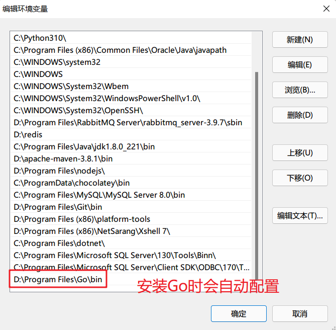
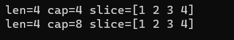
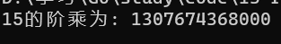
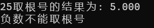

# GO语言学习

## 进度记录

通过阅读菜鸟教程文档进行学习

https://www.runoob.com/go

**2022/4/30**

变量 -> 变量声明 ✔

...

变量作用域 ✔

TODO 数组 ✔

**2022/5/1**

数组 ✔

...

结构体 ✔

TODO 切片 ✔

...

并发 ✔

基础完结撒花

## 环境安装（Windows）

1. 下载Go语言安装包（msi）

链接：https://go.dev/dl/

2. 将bin目录配置为环境变量



3. 配置Go的模块代理

```sh
go env -w GO111MODULE=on
go env -w GOPROXY=https://goproxy.cn,direct
```


## 语言结构

Go语言的基础组成有以下部分：

- 包声明
- 引入包
- 函数
- 变量
- 语句 & 表达式
- 注释

Go语言中没有面向对象语言中public、protected等修饰符，相对应的修饰限制如下：

- 标识符使用**大写字母开头**，表示使用这种形式的标识符的对象**可以**被外部访问（外界需要引入当前包），相当于public修饰符
- 标识符使用**小写字母开头**，则对包外是不可见的。但是对于整个包的内部是可见且可被访问的，相当于protected修饰符

### Hello World程序

```go
package main

import "fmt"

func main() {
	// 这是我的第一个简单程序，使用的是行内注释
	/*
		这段注释使用的是块注释
	*/
	fmt.Println("Hello World!")
}
```

`package main`：

在每个Go文件中，都应该在**非注释**的第一行进行包声明；在一个Go程序中，必须有一个引入main包的文件，表示程序的入口。

`import "fmt"`:

告诉Go编译器这个程序需要使用到"fmt"包中的函数或其它元素，“fmt”包实现了格式化的IO（输入/输出）函数。

`func main()`:

程序开始执行的函数，一般来说在一个可执行程序中，main函数是在启动后第一个执行的函数（**如果程序中含有`init`函数，则首先执行初始化**）。

`// /**/`:

行内注释和块注释，与Java语言相同。

`fmt.Println()`:

控制台输出函数，与Java中`System.out.println()`方法作用相同。

### 运行Go程序

方式1，直接运行程序：

```sh
go run {文件名，如hello.go}
```


方式2，先编译成二进制文件，再直接运行：

```sh
# 编译
go build hello.go
# 运行
./hello
```


**注意：**Go语言规定，`{`符号不能单独占据一行，否则会报错。

## 基础语法

### 标记

Go程序可以由多个标记组成，可以是关键字、标识符、符号、字符串、常量。

```go
fmt.Println("Hello World!")
```

在以上代码中，共有`6`种标记：

分别是`fmt`、`.`、`Println`、`(`、`"Hello World"`、`)`

### 行分隔符

在Go语言种不像其他很多语言一样需要使用`;`符号进行结尾，**一行代表一个语句结束**。

如果要强行将两个语句写在同一行，则需要使用`;`符号进行人为区分。（不推荐）

```go
fmt.Println("Hello World!")
fmt.Println("haha")
```

以上代码为两个语句。

### 注释

Go语言注释与其它语言基本相同：

- `//`：单行注释
- `/**/`：块注释

### 标识符

标识符用来命名变量、类型等程序实体。

标识符可以由一个或多个字母（A-Z或a-z）数字（0-9）下划线（_)组成的序列，但是第一个字符必须是字母或者是下划线，不能是数字。

### 字符串连接

Go语言的字符串连接可以使用`+`符号连接，与Java相同

### 关键字

Go语言有以下`25`个关键字或保留字：

**加粗**的为Java语言种没有的关键字

|                |                 |                       |           |            |
| -------------- | --------------- | --------------------- | --------- | ---------- |
| break          | default         | **func**              | interface | **select** |
| case           | **defer**       | **go**(开启goroutine) | **map**   | struct     |
| **chan**(通道) | else            | goto                  | package   | switch     |
| const          | **fallthrough** | if                    | **range** | **type**   |
| continue       | for             | import                | return    | **var**    |

Go语言还有`36`个预定义标识符：

|         |           |            |         |       |
| ------- | --------- | ---------- | ------- | ----- |
| append  | bool      | byte       | cap     | close |
| complex | complex64 | complex128 | uint16  | copy  |
| false   | float32   | float64    | imag    | int   |
| int8    | int16     | uint32     | int32   | int64 |
| iota    | len       | make       | new     | nil   |
| panic   | uint64    | print      | println | real  |
| recover | string    | true       | uint    | uint8 |
| uintptr |           |            |         |       |

### 空格

Go语言变量的声明必须使用空格隔开，如：

```go
var age int
```

### 格式化字符串

使用`fmt.Sprintf()`函数可以格式化字符串，如Java语言中的`System.out.printf()`

实例代码：

```go
package main

import (
	"fmt"
)

func main() {
	// %d表示整形数字，%s表示字符串
	var code = 123
	var enddate = "2022/4/30"
	var target = fmt.Sprintf("code=%d&endDate=%s", code, enddate)
	fmt.Println(target)
}
```


## 数据类型

Go语言按照类别有以下几种类型：

**布尔型：**

布尔型的值只可以是常量`true`和`false`

**数字类型：**

整形`int`和浮点型`float32`、`float64`

Go有基于架构的类型，例如：`int`、`uint`和`uintptr`

整数型：

| 序号 | 类型和描述                                                   |
| ---- | ------------------------------------------------------------ |
| 1    | **uint8**（无符号8位整型[0, 255]）                           |
| 2    | **uint16**（无符号16位整型[0, 65535]）                       |
| 3    | **uint32**（无符号32位整型[0, 4294967295]）                  |
| 4    | **uint64**（无符号64位整型[0, 18446744073709551615]）        |
| 5    | **int8**（有符号8位整型[-128, 127]）                         |
| 6    | **int16**（有符号16位整型[-32768, 32767]）                   |
| 7    | **int32**（有符号32位整型[-2147483628, 2147483647]）         |
| 8    | **int64**（有符号64位整型[-9223372036854775808, 9223372036854775807]） |

浮点型：

| 序号 | 类型和描述                          |
| ---- | ----------------------------------- |
| 1    | **float32**（IEEE754 32位浮点型数） |
| 2    | **float64**（IEEE754 64位浮点型数） |
| 3    | **complex64**（32位实数和虚数）     |
| 4    | **complex128**（64位实数和虚数）    |

其他数字类型：

| 序号 | 类型和描述                                  |
| ---- | ------------------------------------------- |
| 1    | **byte**（字符型，等价于uint8)              |
| 2    | **rune**（类似int32)                        |
| 3    | **uint**（32或64位）                        |
| 4    | **int**（与uint一样大小）                   |
| 5    | **uintptr**（无符号整型，用于存放一个指针） |

**字符串类型**

**派生类型：**

- 指针类型（Pointer）
- 数组类型
- 结构化类型（struct）
- **Channel类型**
- 函数类型
- **切片类型**
- 接口类型（interface）
- Map类型

## 变量

声明变量的一般形式是使用`var`关键字：

```go
var identifier type
```

也可以一次声明多个变量：

```go
var identifier1, identifier2 type
```

实例：

```go
package main

import "fmt"

func main() {
	var name string = "Ambitious"
	fmt.Println(name)
	var code1, code2 int = 1, 2
	fmt.Println(code1, code2)
}
```


### 声明变量

1. 指定变量类型，如果没有初始化，变量默认为零值

零值就是变量没有初始化时系统默认设置的值

```go
var name type
name = value
```

实例：

```go
// 变量声明
// 1 手动赋值初始值
var name = "ZhangSan"
// 2 使用默认零值
var a int
var b bool
fmt.Print(name, a, b)
```


以下列出不同变量类型的零值：

- 数值类型（包括complex64/128）为**0**

- 布尔类型为**false**

- 字符串为**""**（空字符串）

- 以下几种类型为**nil**

  ```go
  var a *int
  var a []int
  var a map[string]int // k:string, v:int的map集合
  var a chan int // int类型的通道
  var a func(string) int // 一个string参数，返回值是int的函数
  var a error // error 是接口
  ```

2. 根据值自动判断变量的类型

```go
var name = value
```

实例：

```go
func definition1() {
	// 根据值自动判断变量类型
	var a = true
	fmt.Println(a)
}
```


3. 使用`:=`声明（前提是变量没有使用`var`声明过）

实例：

```go
func definition2() {
	// 使用:=进行变量声明
	intVal := 1
	stringVal := "Ambitious"
	fmt.Println(intVal, stringVal)
}
```


`intVal := 1`相当于`var intVal = 1`

### 多变量声明

```go
func definition3() {
	// 多变量声明
	var a, b, c int
	a, b, c = 1, 2, 3
	fmt.Println(a, b, c)

	var d, e, f = 4, 5, 6
	fmt.Println(d, e, f)
	
    // 这种不带声明格式的只能在函数体中使用
	g, h, i := 7, 8, 9
	fmt.Println(g, h, i)

	// 使用因式分解的写法一般用于声明全局变量
	var (
		j int
		k string
	)
	j = 10
	k = "hahaha"
	fmt.Println(j, k)
}
```


### 值类型和引用类型

所有像int、float、bool、string这些基本类型都属于值类型，使用这些类型的变量直接指向存在内存中的值。

可以通过`&i`来获取变量i的内存地址


复杂的数据通常会需要使用多个字，这些数据一般使用引用类型保存。

一个引用类型变量存储的是变量值所在的内存地址，或内存地址中第一个字所在的位置，这个内存地址称为指针。

引用类型的指针指向的多个字可以在连续的内存空间中，也可以将这些字分散在内存中，每个字都指示了下一个字所在的内存地址。

### 使用:=赋值操作符

在声明变量的时候可以由系统自动推断类型，但是每次都写var关键字就显得有些多余，大多时候都是使用:=操作符类代替var关键字，称之为**初始化声明**。

**注意事项：**

1. 这种操作符只能用于函数体内，不能用于全局变量的声明与赋值。
2. 在相同的代码块中，不可以再次对于相同名称的变量使用初始化声明。


如果声明了一个局部变量却没有在相同的代码块中去使用它，则编译会报错。而全局变量则允许只声明不使用。


多变量可以在同一行中进行赋值，如：

```go
a, b, c := 1, 2, "abc"
```

这种赋值被称为并行赋值。

如果想要交换两个变量的值，可以简单的使用`a, b = b, a`来进行交换，前提是两个变量的类型是相同的。

Go语言的特点之一是函数可以返回多个值，但有时候调用函数时不需要使用函数所有的返回值，可以使用空白标识符（`_`)来进行占位，如：

```go
_, a = Func(val)
```

`_`是一个只写变量，通常用于抛弃不想要的值。

## 常量

常量中的数据类型只可以是布尔型、数字型和字符串型

常量的定义格式：

```go
const identifier [type] = value
```

> 可以省略类型说明符type，由编译器自动推断类型

常量使用示例：

```go
package main

import (
	"fmt"
	"unsafe"
)

func main() {
	// 1 常量完整的定义形式
	const WIDTH int = 10
	const HEIGHT int = 20
	area := WIDTH * HEIGHT
	fmt.Println(area)
	// 2 使用并行赋值常量
	const a, b, c = 1, false, "abc"
	fmt.Println(a, b, c)
	// 3 常量用作枚举
	const (
		// 未知
		Unknow = 0
		// 男性
		Female = 1
		// 女性
		Male = 2
	)
	fmt.Println(Unknow, Female, Male)
	// 4 在常量中使用内置函数计算表达式的值
	const (
		d = "abc"
		e = len(d)
		f = unsafe.Sizeof(a)
	)
	fmt.Println(d, e, f)
}
```


### iota

iota是一个特殊常量，可认为是一个可以被编译器修改的常量，也可理解为const语句块中的行索引

示例：

```go
func iota_test() {
	// iota常量用作枚举
	const (
		a = iota
		b = iota
		c = iota
	)
	fmt.Println(a, b, c)
	// 常量枚举的简写
	const (
		d = iota
		e
		f
	)
	fmt.Println(d, e, f)
}
```


- iota会从0开始，随着常量代码块行数的增加而增加，不会受外界影响。
- 在常量枚举中，如果定义的常量没有赋值（第一个常量必须赋值），则会使用它上方最近一个被赋值过的常量作为自己的值。在以上例子中，e、f只声明，没有赋值，所以会使用d的值iota作为自己的值。

## 运算符

运算符用于在程序运行时执行数学或逻辑运算

Go语言内置的运算符有：

- 算术运算符
- 关系运算符
- 逻辑运算符
- 位运算符
- 赋值运算符
- 其他运算符

### 算术运算符

+、-、*、/、%、++、--（与Java相同）

### 关系运算符

==、!=、>、<、>=、<=（与Java相同）

### 逻辑运算符

&&、||、!（与Java相同）

### 位运算符

&、|、^、<<、>>（与Java相同）

### 赋值运算符

=、+=、-=、*=、/=、%=、<<=、>>=、&=、^=、|=（与Java相同）

### 其他运算符

&：返回变量存储地址（&a会给出变量a的实际存储地址）

*：指针变量（ *a是一个指针变量）

## 条件语句（与Java相同）

## 循环语句


### for循环

for循环有三种形式，分别如下

1. 与C语言的for一样

```go
for init; condition; post {
    code...
}
```

2. 与C语言的while一样

```go
for condition {
    code...
}
```

3. 与C语言的for(;;)一样（无限循环）

```go
for {
    code...
}
```

4. range格式

可以对slice、map、数组、字符串等进行迭代遍历：

```go
for key, value := range oldMap {
    newMap[key] = value
}
```

```go
package main

import "fmt"

func main() {
	numbers := [6]int{1, 2, 3, 4, 5}
	for index, number := range numbers {
		fmt.Printf("第 %d 位的数为 %d\n", index, number)
	}
}
```


> 小记：
>
> 在Java语言中，如果要动态初始化一个数组可以用以下方式：
>
> ```java
> int n = 100;
> int[] arr = new int[n];
> ```
>
> 在Go语言中，可以使用make函数来实现相同的功能，这种方式创建出来的数据类型是切片（slice），下文会详细说明
>
> ```go
> n := 100
> arr := make([]int, n)
> ```

### 循环嵌套

与Java语言没有太大差别

### 循环控制语句

break: 中断当前for循环或switch语句

continue：跳过当前循环剩余的语句，并进行下一轮循环

goto：将控制转移到标记语句（goto语句会降低程序的可读性，一般不建议使用）

## 函数

Go语言中函数定义格式如下：

```go
func function_name([parameter_list]) [return_type] {
    code...
}
```

- func：函数由func关键字声明
- function_name：函数名称
- parameter_list：参数列表，函数可以不指定参数
- return_types：返回类型，函数返回一列值，return_types是该列值的数据类型，return_types也不是必须的。

示例：

求两个整型数中的较大值

```go
// 求两数的最大值，接收两个整型数，返回两个数中较大数
func max(a, b int) int {
	// 定义局部变量
	var res int
	if a < b {
		res = b
	} else {
		res = a
	}
	return res
}
```

### 函数返回多个值

将返回值列表拼接在参数列表后边，并用`()`括起来即可

```go
func swap(a, b string) (string, string) {
	return b, a
}
```


### 函数参数

使用值传递：在调用函数时将实际参数复制一份传递到函数中。

使用引用传递：在调用函数时将实际参数的地址传递到函数中。

默认情况下，Go语言使用的是值传递。


使用引用传递交换两个数的例子：

```go
func main() {
	c, d := 200, 300
	fmt.Printf("交换前c=%d, d=%d\n", c, d)
    // 传入两个变量的地址
	swapInt(&c, &d)
	fmt.Printf("交换后c=%d, d=%d\n", c, d)
}

// 将传递过来的两个引用进行交换
func swapInt(a, b *int) {
	tmp := *a
	*a = *b
	*b = tmp
}
```


## 变量作用域（与Java相同）

- 全局变量
- 局部变量
- 形式参数（函数中定义的变量，也是局部变量）

## 数组

### 声明数组

声明数组的时候需要指定数组的类型和元素的个数：

```go
var array_name [SIZE]type
```

声明一个长度为10，类型为float32的数组balance代码如下：

```go
var balance [10]float32
```

### 初始化数组

1. 常规初始化方法

```go
var arr1 = [5]int{1, 2, 3, 4, 5}
```

2. 使用字面量快速初始化

```go
arr2 := [6]int{1, 2, 3, 4, 5, 6}
```

3. 让编译器自动推断数组的长度

> 如果不加`...`，创建出来的是切片

```go
arr3 := [...]int{1, 2, 3, 4, 5, 6, 7}
```

4. 通过指定下标初始化元素（前提是数组已经指定了长度）

```go
arr4 := [5]int{1: 3, 3: 8}
```

`{}`中元素的个数不能超过`[]`中指定的数组大小

如果`[]`中不指定数组的大小，编译器会自动根据`{}`中元素的个数设置数组的大小

### 访问数组元素（与Java相同）

### 多维数组

常用的多维数组声明方式：

```go
var array_name [SIZE1][SIZE2]...[SIZEN]type
```

声明一个三维的整型数组：

```go
var arr [5][10][4]int
```

### 初始化二维数组

1. 在声明的时候给整个数组直接赋值

```go
arr5 := [3][4]int{
    {1, 2, 3, 4},
    {5, 6, 7, 8},
    // 最后一行的末尾必须加上逗号，否则编译器会报错
    {9, 10, 11, 12},
}
```

2. 声明数组之后，使用`append`函数进行赋值

```go
// 这里不能指定数组的大小，否则编译器会报错
arr6 := [][]int{}
arr6 = append(arr6, []int{1, 2, 3})
arr6 = append(arr6, []int{4, 5, 6})
```

> 疑问解答：为什么使用append函数时不能指定“数组”的大小？
>
> 当初始化一个数组指定了具体的大小时，它是一个普通数组。如果不指定大小，那么它是一个切片（slice）。
>
> append函数的参数接收的值**必须**是切片，所以传入一个数组的时候会报错。

访问二维数组的时候与Java相同，不再赘述

### 向函数传递数组

1. 形参设定数组大小

```go
func myFunction(param [10]int) {
    // code...
}
```

2. 形参不设定数组大小

```go
func myFunction(param []int) {
    // code...
}
```

示例：

定义函数`getAverage`，接收一个数组，并计算数组的平均值

```go
func main() {
	// 定义函数`getAverage`，接收一个数组，并计算数组的平均值
	arr7 := []int{1, 2, 5, 8, 1}
	ans := getAverage(arr7)
	fmt.Printf("数组的平均值为：%.3f", ans)
}

// 计算一个数组的平均值
func getAverage(arr []int) (ans float32) {
	if arr == nil {
		return
	}
	// 获取数组的大小
	n := len(arr)
	for i := 0; i < n; i++ {
		ans += float32(i)
	}
	ans /= float32(n)
	return
}
```


## 指针

指针指向了一个值的内存地址

指针声明语法如下：

```go
var ptr_name *type
```

声明一个指向整型的指针和一个指向浮点型的指针

```go
var ip *int
var fp *float32
```

示例：

定义一个整型变量和一个整型指针，用指针指向该变量的内存地址

```go
var a int
var ap *int
a = 1
ap = &a
fmt.Printf("变量a的地址为: %x\n", &a)
fmt.Printf("指针ap的值为: %x\n", ap)
fmt.Printf("指针ap指向的地址的内容为: %d\n", *ap)
```


### 空指针

Go语言中使用`nil`表示空指针，代表零值或空值

### 指针数组

与数组基本一致，只不过指针数组专门存储指针

声明指针数组的语法：

```go
var ptr [SIZE]*int
```

### 指向指针的指针

指针变量存放的是另一个指针变量的地址

声明指向指针的指针格式如下：

```go
var pptr **int
```

要访问指向指针的指针变量值需要使用两个`*`号：

```go
fmt.Printf("变量值为: %d\n", **pptr)
```

### 指针作为函数参数

使用方式非常简单，只需要在函数定义的参数设置为指针类型即可。

在[函数参数](#函数参数)章节中已经给出使用指针作为函数参数，交换两个整型变量值的例子，这里不在举例。

## 结构体

与C语言一样，Go语言可以自定义结构体类型，在结构体中可以为不同项定义不同的数据类型，这里可以将结构体理解为Javascript中的对象。

### 定义结构体

结构体定义需要使用`type`和`struct`语句。如下：

```go
// 图书结构
type Book struct {
	id int
	title string
}
```

### 声明结构体

```go
// 声明结构体1
book1 := Book{1, "计算机网络"}
// 声明结构体2
book2 := Book{title: "程序员代码面试指南", id: 2}
fmt.Println(book1, book2)
```


### 访问结构体成员

访问方式如下：

与其他很多语言都类似，不再赘述

```go
结构体.成员名
```

结构体可以跟其它数据类型一样：

- 作为函数参数
- 使用一个结构体类型指针指向一个结构体变量

## 切片（slice）

切片是对数组的抽象

数组和切片的区别是数组的长度不可改变，而**切片的长度是可以改变的**，即动态数组。

### 定义切片

定义切片与定义数组相似，区别就是切片不需要指定数组的长度。

1. 常规的定义方式

```go
var identifier []type
```

2. 使用`make()`函数来定义切片

>  这种方式在之前小记([循环语句](#循环语句))中提到过，并与java动态初始化数组进行比较。

make函数的定义：

```go
func make(T type, size ...int)
```

创建一个int类型的，长度为len的切片

```go
slice := make([]int, len)
```

创建一个int类型的，初始长度为0，容量为len的切片

容量（capacity）指定了当前切片的**最大长度**（解释见下文）

```go
slice := make([]int, 0, len)
```

### 切片初始化

1. 与数组相同的初始化方式

```go
slice1 := []int{1, 2, 3}
```

2. 初始化切片为一个数组的引用

```go
arr := [5]int{1, 2, 3, 4, 5}
slice2 := arr[:]
```

3. 以数组中某个范围内的元素作为初始值初始化切片

取出数组arr中区间`[1, 3)`范围内的元素来初始化切片

```go
slice3 := arr[1:3]
```

取出数组arr中区间`[0, 3)`范围内的元素来初始化切片

```go
slice4 := arr[:3]
```

取出数组arr中区间`[1, len(arr))`范围内的元素来初始化切片

```go
slice5 := arr[1:]
```

### len()和cap()函数

切片是可索引的，且可以使用`len()`函数获取长度

`cap()`函数用来测量切片的容量最大可以到多少

编写一个打印切片参数的函数：

```go
// 打印切片长度、容量、内容
func printSlice(x []int) {
	fmt.Printf("len=%d cap=%d slice=%v\n", len(x), cap(x), x)
}
```

用此函数打印上面案例中的几个切片，得出结果如下：


注意到最后一个切片的最大容量为4，

原因是这个切片是以arr作为底层数组而创建的，总长度不能超过原数组长度（原数组长度为5），而切片又从原数组的第1项（0是起始）进行索引，故该切片的最大容量就为4。

### 空切片

一个切片在未初始化之前默认为nil，长度为0

### append()和copy()函数

如果想要增加切片的容量，就需要创建一个新的更大的切片，并将原有的切片拷贝过去。

> 小记
>
> 切片在容量不足的时候会有一个自动扩容的机制：
>
> 1. 原切片容量的两倍如果小于等于当前所需的容量，则切片扩容到当前所需的容量
> 2. 原切片容量的两倍大于当前所需的容量，进一步判断：
>    1. 原切片容量超过`1024`：每次增大的容量为原切片容量的`1/4`，当切片容量大于等于当前所需容量时，停止扩容
>    2. 原切片容量不超过`1024`：切片扩容为原切片容量的两倍

示例：

```go
// 增大切片容量
var numbers1 []int
// 向切片中追加1个元素
numbers1 = append(numbers1, 1)
// 向切片中追加多个元素
numbers1 = append(numbers1, 2, 3, 4)
printSlice(numbers1)
// 创建一个容量为原来的两倍的切片
numbers2 := make([]int, len(numbers1), 2*len(numbers1))
// 将原切片的数据拷贝到新切片上
copy(numbers2, numbers1)
printSlice(numbers2)
```



从运行结果可以看到，新切片保留了原切片的值，并扩大了一倍的容量

## 范围（range）

range关键字用于for循环中迭代数组（array）、切片（slice）、通道（channel）和集合（map）的元素。对于数组和切片，它返回索引和索引对应的值，对于集合，它返回key-value。

示例：

```go
func main() {
	// 定义一个数组
	arr := [5]int{1, 2, 3, 4, 5}
	// 场景1：求和，只需要用到数本身，所以第一个参数可抛弃
	sum := 0
	for _, v := range arr {
		sum += v
	}
	fmt.Println(sum)
	// 场景2：查找，找到数组中某个值位于哪一索引下
	for index, item := range arr {
		if item == 3 {
			fmt.Printf("数字3对应的索引为: %d\n", index)
		}
	}
	// 场景3：遍历集合
	kvs := map[string]string{"chen": "junjun", "zhang": "san"}
	for k, v := range kvs {
		fmt.Printf("%s -> %s\n", k, v)
	}
	// 场景4：按照Unicode遍历字符串
	for i, v := range "go" {
		fmt.Printf("i: %d, v: %c\n", i, v)
	}
}
```


## Map集合

Map是一种无序的键值对集合，可以通过key来快速检索数据

### 定义map

1. 使用map关键字

```go
// 声明并初始化map
var name = map[key_type]value_type {}
```

2. 使用make函数

```go
name := make(map[key_type]value_type)
```

map的简单使用：

```go
func main() {
	// 1 创建一个国家名称map
	countryMap := make(map[string]string)
	countryMap["France"] = "巴黎"
	countryMap["Italy"] = "意大利"
	countryMap["Japan"] = "东京"
	// 2 输出国家首都名
	for key := range countryMap {
		fmt.Printf("%s的首都是: %s\n", key, countryMap[key])
	}
	// 3 判断一个国家是否存在于map中
	capital, ok := countryMap["American"]
	fmt.Println(capital)
	fmt.Println(exist)
	if ok {
		fmt.Printf("American的首都是: %s\n", capital)
	} else {
		fmt.Println("American不在map集合中")
	}
}
```


### delete()函数

可以使用delete函数来删除集合中的元素，使用格式如下：

```go
delete(map_name, key_name)
```

## 递归（recursion）

Go语言进行递归与其他语言相似，这里给出递归求解阶乘的例子：

```go
func main() {
	ans := factorial(15)
	fmt.Printf("15的阶乘为: %d\n", ans)
}

// 递归求解一个数的阶乘
func factorial(n uint64) uint64 {
	if n == 1 {
		return 1
	}
	return n * factorial(n-1)
}
```



## 类型转换

Go中必须显式进行类型转换，格式如下：

```go
type_name(value)
```

将int类型的数转换为float32类型

```go
var a int
var b float32
a = 100
b = float32(a)
```

## 接口

Go语言可以像Java一样定义接口，可以针对不同的结构体给出不同的实现

### 定义方式

```go
type interface_name interface {
    method_name1 [return_type]
    method_name2 [return_type]
}
```

示例：

在这个例子中，结构体就相当于面向对象语言中的实现类，结构体实现接口的标志就是实现接口中定义的**所有方法**，不需要显示指定实现接口。

```go
// 定义一个手机接口
type Phone interface {
	// 打电话给某某人
	call(name string)
}

// 诺基亚结构体
type NokiaPhone struct{}

// 接口实现
func (phone NokiaPhone) call(name string) {
	fmt.Printf("使用诺基亚手机打电话给%s\n", name)
}

// 苹果手机结构体
type IPhone struct{}

// 接口实现
func (phone IPhone) call(name string) {
	fmt.Printf("使用苹果手机打电话给%s\n", name)
}

func main() {
	var phone Phone
	// 使用诺基亚实现
	phone = new(NokiaPhone)
	phone.call("张三")
	// 使用苹果手机实现
	phone = new(IPhone)
	phone.call("李四")
}
```

## 错误处理

Go语言内置了一个错误接口error，提供了简单的错误处理机制。

error接口的定义如下：

```go
type error interface {
    Error() string
}
```

使用方式：

在编码的时候通过实现error接口类型来生成错误信息，

函数通常在最后的返回值中返回错误信息

1. 使用`errors.New`直接返回错误信息

```go
// 对一个数取根号
// 返回两个参数，一个是取根号后的结果，另一个是error接口类型
func Sqrt(n int) (float64, error) {
	if n < 0 {
		// 负数无法求根号
		return 0, errors.New("负数不能取根号")
	}
	return math.Sqrt(float64(n)), nil
}

func main() {
    // 测试1：传入正常的值求根号
	ans1, err1 := Sqrt(25)
	if err1 == nil {
		fmt.Printf("25取根号的结果为: %.3f\n", ans1)
	} else {
		fmt.Println(err1)
	}
	// 测试2：传入异常值
	ans2, err2 := Sqrt(-3)
	if err2 == nil {
		fmt.Printf("-3取根号的结果为: %.3f\n", ans2)
	} else {
		fmt.Println(err2)
	}
}
```



2. 自定义结构体，实现error接口

```go
// 除法异常结构体
type DevideError struct {
	devidee int
	devider int
}

// 除法异常实现error接口
func (de DevideError) Error() string {
	msg := `
		除法运算执行错误, 除数不能为0
		devidee: %d
		devider: 0
	`
	return fmt.Sprintf(msg, de.devidee)
}

// 除法函数
// 这里的第二个返回值可以使用error接口进行替代
func Devide(devidee, devider int) (float64, *DevideError) {
	if devider == 0 {
		return 0, &DevideError{devidee, devider}
	}
	return float64(devidee / devider), nil
}

func main() {
    // 测试3：正常除法
	ans3, err3 := Devide(9, 3)
	if err3 == nil {
		fmt.Printf("9 / 3 的结果为: %.3f\n", ans3)
	} else {
		fmt.Println(err3)
	}
	// 测试4：异常除法
	ans4, err4 := Devide(9, 0)
	if err4 == nil {
		fmt.Printf("9 / 0 的结果为: %.3f\n", ans4)
	} else {
		fmt.Println(err4)
	}
}
```


## 并发

Go语言只需要使用`go`关键字就可以开启一个轻量级运行时线程（goroutine）。

同一个程序的线程共享同一个线程空间

语法格式：

```go
// 使用非匿名函数开启线程
go 函数名(参数列表)
// 使用匿名函数开启线程
go func(参数类型...) {
    // code...
}(参数列表)
```

goroutine示例：

```go
// 每隔1s打印字符串一次
func say(str string) {
	for i := 0; i < 5; i++ {
		time.Sleep(time.Second)
		fmt.Println(str)
	}
}

func main() {
	go say("hello")
	say("world")
}
```


### 通道（channel）

通道是用来传递数据的数据结构，可用于两个goroutine之间通过传递一个指定类型的值来同步运行和通讯。

操作符`<-`用于指定通道的方向，如果未指明方向，则为双向通道。

使用方法：

```go
ch <- v // 将数据v发送到通道ch中
v := <-ch // 从通道ch接收一个数据，并赋值给v
```

声明一个简单的通道：

```go
ch := make(chan int)
```

默认情况下，通道是**不带缓冲区的**，也就是说：

- 当数据写入通道时，会立即阻塞，直到接收端将数据接收出去时才接触。
- 当接收端从通道中接收数据时，如果通道中没有数据，接收端线程也会立即阻塞，直到发送端将数据写入时，接收端的阻塞才会解除并接收数据。

示例：

定义一个数组，并创建两个goroutine，分别求和数组中的一部分元素，然后再将两个求和结果相加得到数组总和。

```go
func sum(slice []int, c chan int) {
	sum := 0
	for _, v := range slice {
		sum += v
	}
	// 将求和结果写入通道中
	c <- sum
}

func main() {
	// go say("hello")
	// say("world")

	arr := []int{3, 9, -3, 2, 7, -6}
	// 创建一个不带缓存的通道
	c := make(chan int)
	go sum(arr[:3], c)
	go sum(arr[3:], c)
	x, y := <-c, <-c
	fmt.Println(x, y, x+y)
}
```


从程序执行顺序来看，分别开启了两个goroutine计算切片中前三个元素的和、后三个元素的和，预计输出应该是`9 3 12`。

实际输出与预期输出不一致，这是因为两个goroutine是异步执行的，而goroutine的调度是由Golang运行时进行管理的，存在随机性。

### 使用带缓冲区的通道存储数据

```go
ch := make(chan int, 100)
// 往通道中一次性存放两个数据，不会阻塞
ch <- 1
ch <- 2
// 将通道中的数据一次性取出来
fmt.Println(<-ch)
fmt.Println(<-ch)
// 故意多往通道中取一次数据
fmt.Println(<-ch)
```


从运行结果中可以看到：

- 使用了带缓冲区的通道之后，前两个数据再存储的时候不会再发生阻塞。
- 当程序从一个空的通道中再尝试获取一个数据时，控制台报错，原因是出现“死锁”

分析出现“死锁”的原因：

- 线程数分析：程序中没有启动子线程，也就是说当前程序只有一个主线程。
- 逻辑分析：通道的工作机制是，当通道中没有数据时，接收方想要接收数据就会阻塞接收方线程，直到通道中进来一个新的数据，才能够解除阻塞并接收数据。

从以上两点就能够知道，当尝试往空的通道接收一个数据时，主线程会阻塞，而此时又没有其他的线程可以发送数据到通道中，导致主线程将永久阻塞，所以造成“死锁”。

### 遍历通道与关闭通道

range关键字除了可以用来遍历数组、切片等数据类型之外，还可以用来遍历通道。

对于range的每一次遍历，都可以获取到两个变量，如下：

```go
v, ok := <-ch
```

- v：从通道ch中取出的数据
- ok：是否成功接收到数据

示例：

创建一个缓冲区为10的goroutine，计算从0开始迭代9次的斐波那契数，并存入通道中，再由主程序接收通道中的数据并打印

```go
// 生成n个斐波那契数，存入通道中
func fibonacci(n int, ch chan int) {
	x, y := 0, 1
	for i := 0; i < n; i++ {
		ch <- x
		x, y = y, x+y
	}
	close(ch)
}

func main() {
	// 生成斐波那契数到通道中，并遍历打印
	ch := make(chan int, 10)
	go fibonacci(cap(ch), ch)
	for v := range ch {
		fmt.Println(v)
	}
}
```


在函数`fibonacci()`的最后，使用`close()`函数关闭了通道。**此时通道中只允许接收值，不再允许发送值**。故在主程序遍历通道的时候，当通道为空时，循环直接退出，而不是像上一个例子一样继续阻塞线程导致“死锁”。

> 小记
>
> 判断一个通道是否已经关闭的两种方法：
>
> 1. 从通道中一次读取两个变量
>
> ```go
> // 如果通道已经关闭了，那么ok的值就为false
> v, ok := <-ch
> ```
>
> 2. 使用range遍历
>
> ```go
> // 如果通道已经关闭了，循环会自动跳出
> for v := range ch {
>     // code...
> }
> ```


基础知识 end

---

进阶 start


## 使用sort.Slice()函数进行自定义优先级排序

`sort.Slice()`函数的定义如下：

```go
func sort.Slice(x any, less func(i int, j int) bool)
```

- x：要排序的数组 / 切片
- less：自定义优先级规则函数
  - i, j：当前比较的两个元素在x中的索引
  - 返回true，i索引元素优先级高，反之j索引元素优先级高

示例：

```go
// 结构体，人
type People struct {
	name string
	age  int
}

func main() {
	arr := []People{}
	arr = append(arr, People{name: "张三", age: 20})
	arr = append(arr, People{name: "李四", age: 15})
	arr = append(arr, People{name: "王五", age: 30})
	fmt.Printf("原切片: %v\n", arr)
	// 将People切片按照每个人的年龄(age)从小到大进行排序
	sort.Slice(arr, func(i, j int) bool {
		// i, j 是索引
		// 排序的规则是：
		// 返回true，i优先；返回false，j优先
		return arr[i].age <= arr[j].age
	})
	fmt.Printf("排序之后的切片: %v\n", arr)
}
```


